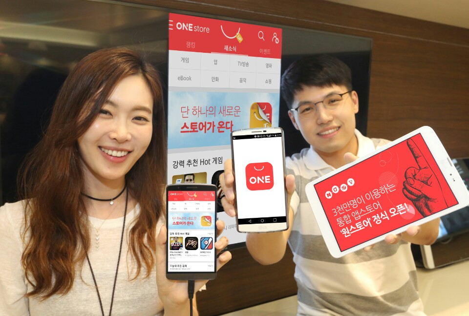

- **\- 통신사 스토어 3천만 회원에 네이버 앱스토어 합쳐 6월 1일 정식 오픈**
- **\- 와이파이 태블릿 등에서도 네이버, 페이스북 등 외부아이디로 로그인하여 이용가능**
- **\- 상시 캐쉬적립 프로그램 시행 및 고객센터 통합으로 혜택은 키우고 불편은 줄여**

회원 3천만명 규모의 통합 앱스토어 '원스토어'가 공식 출범한다. 원스토어 주식회사(대표 이재환), 네이버(주)(대표 김상헌), (주)엘지유플러스(부회장 권영수), KT(회장 황창규)는 네 회사의 앱스토어를 통합하여, 6월 1일 '원스토어'서비스를 개시한다고 밝혔다.

'원스토어'는 기존 스토어들과 동일하게 안드로이드 기반 스마트폰 및 태블릿에서 이용 가능하다. 통신사 스토어(T스토어, 올레마켓, U+스토어)를 실행하면 '원스토어'로 업그레이드되고, 네이버 앱스토어 이용자는 원스토어를 실행한 뒤 네이버 아이디로 로그인하면 기존 구매내역을 가져올 수 있다. 초기 이용자 수는 통신사 스토어에 네이버 앱스토어를 더해 3천만명 이상이 될 전망이다. 이번 원스토어의 출범으로 국내 안드로이드 앱 유통 플랫폼 시장은 원스토어와 구글 플레이간 양자 경쟁구도로 재편된다.

통합 스토어의 사업을 담당하는 원스토어 주식회사는 서비스 활성화를 위해 이용환경부터 개선한다는 계획이다. 원스토어는 아이디 로그인을 지원하여 번호이동 등으로 휴대전화번호가 바뀌어도 기존의 사용이력을 그대로 가져와 서비스를 이용할 수 있으며 국내전화번호가 없는 와이파이 태블릿이나 해외휴대전화도 이용이 가능하다. 자체 계정 외 이용자 본인이 사용중인 네이버, 페이스북, 구글 등의 아이디로 로그인할 수도 있어, 보다 간편하게 이용할 수 있다.

이용자에게 제공되는 혜택도 대폭 늘어난다. 기존의 할인 및 쿠폰지급 이벤트 외에도, 게임 이용자의 원스토어 결제금액의 일정 비율을 포인트로 쌓아주는 캐쉬 적립 프로그램이 시행된다. 원스토어 측은 유료결제가 활발한 게임 카테고리에 해당 제도를 도입하여 이용자들이 실질적인 혜택을 체감할 수 있도록 한다는 방침이다.

고객들의 문의를 해결하는 창구도 통합하여 이용자들에게 원스톱 서비스를 제공할 계획이다. 이메일 상담은 물론 국내 앱스토어 중에서는 유일하게 전화상담(문의처 1600-6573)까지 한곳에서 지원할 방침이다. 단일 고객센터를 통해 콘텐츠의 구매-이용-사후지원의 전 과정이 통합 관리되어 보다 빠른 이용자 응대가 가능할 것으로 전망된다.

원스토어 관계자는 "이번 통합서비스 런칭을 통해 기존 이용자들의 불편을 해소함은 물론 원스토어 사업에 참여하는 통신사업자들과 인터넷 사업자간의 시너지를 통해 고객들의 혜택을 극대화할 수 있을 것으로 기대한다"며, "원스토어는 앱, 게임, 전자서적, 음악, VOD 등 모든 디지털 콘텐츠는 물론 휴대폰 액세서리 쇼핑까지 한 곳에서 즐길 수 있는 대한민국을 대표하는 서비스로 성장할 계획"이라고 밝혔다.

한편, 원스토어는 서비스 출시를 기념하여 6월 1일부터 '하루 안에 1천만 포인트 쓰기' 등 최대 1천만원까지 혜택이 주어지는 런칭 이벤트를 진행한다. 상세한 내용은 휴대기기에서 원스토어를 실행하면 확인할 수 있다.
