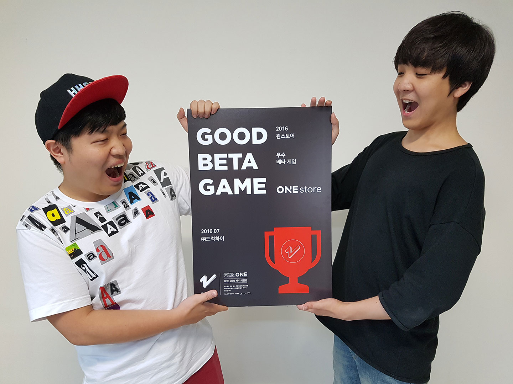

- **\- 29일부터 원스토어 통해 우수베타게임 "톤톤해적단" 서비스 제공**
- **\- 다음 베타테스트는 8월 12일부터 2주간 진행 예정**

원스토어 주식회사(대표: 이재환)는 ㈜드럭하이의 "톤톤해적단"을 7월의 우수베타게임으로 선정했다고 밝혔다. 12일부터 25일까지 운영된 7월의 베타게임존에는 3천여 명의 유저가 참여하였으며, 그 중 우수베타게임으로 선정된 "톤톤해적단"은 테스트기간 중 기민한 운영 능력과 테스트 안정성을 선보였다는 평을 받았다.

"톤톤해적단"은 (주)드럭하이가 개발한 Drag & Release 방식의 슈팅 게임으로, 유저는 자신만의 해적단을 꾸려서 적들의 배를 약탈하고 영역을 확장해 나갈 수 있다. 특히 대포를 이용해 유저의 해적을 적들의 배 위에 날리면 자동으로 전투를 벌이는 독특한 방식의 플레이를 선보여 신선하다는 반응을 얻고 있다. "톤톤해적단"은 7월 29일부터 원스토어를 통해 만날 수 있다.

㈜드럭하이의 최영윤 공동대표는 "이번 베타게임존을 진행하면서 원스토어의 폭넓은 게임유저층으로부터 게임에 대한 유의미한 피드백을 받을 수 있었고, 정식 출시뿐만 아니라 향후 게임기획 시 유용하게 참고할 수 있는 자료를 확보할 수 있게 되었다"고 밝혔다.

또한 원스토어 주식회사의 이재환 대표는 "장르 획일화가 점차 심화되고 있는 국내 모바일게임 환경에서 고객선택권의 확대 차원에서 베타게임존을 포함한 원스토어의 여러 중소개발 지원프로그램들은 중요한 의미를 가진다. 앞으로도 원스토어는 중소개발사들과 게임 유저들이 상호 교류할 수 있는 접점을 마련하기 위해 지속적으로 노력하겠다"고 밝혔다.

다음 베타테스트는 오는 8월 12일(금)부터 25일(목)까지 14일간 진행될 예정이다. 유저가 베타게임존 게임을 다운받아 플레이 후 설문을 작성하면 이 중 최대 100명에게 원스토어 게임 캐쉬 1만원이 제공되며, 우수베타게임으로 선정되는 게임에는 정식 출시 시 5,000만원 상당의 마케팅 지원이 제공될 예정이다. 보다 자세한 내용은 원스토어 개발자센터에서 확인할 수 있다.
