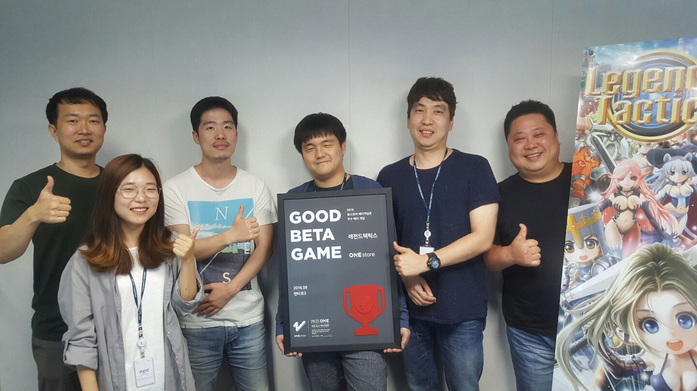

- **\- 정식 출시 시, 5000만원 상당의 마케팅 지원**
- **\- 다음 베타테스트는 9월 12일부터 2주간 진행 예정**

원스토어 주식회사(대표: 이재환)는 (주)엔타로쓰리의 "레전드택틱스"를 8월의 우수베타게임으로 선정, 출시 시 5,000만원 상당의 마케팅을 지원하기로 했다고 밝혔다. 지난 12일부터 25일까지 운영된 8월의 베타게임존에는 총 6천여 명 이상의 유저가 참여하였으며, 그 중 우수베타게임으로 선정된 "레전드택틱스"는 전략성과 게임성을 두루 겸비했다는 유저들의 평을 받으며 테스트를 성공리에 마쳤다.

"레전드택틱스"는 (주)엔타로쓰리가 개발한 실시간 턴제 RPG 게임으로써, 개성 있는 특수 스킬을 가진 다양한 캐릭터들로 자신만의 진형을 꾸려서 적들을 물리치는 게임이며, 기존 RPG와는 차별화한 체스형 RPG라는 독특한 방식의 플레이를 선보이고 있다. "레전드택틱스"는 베타게임존 테스트기간 동안 축적된 데이터를 기반으로 게임 개선작업을 진행한 후 원스토어를 통해 출시할 예정이다.

(주)엔타로쓰리의 황석윤 대표는 "원스토어를 통해 폭넓은 게임이용자들에게 유의미한 피드백을 받을 수 있었다"며, 이를 통해 "게임에 참고할 수 있는 자료를 확보 후 보강하고 있다"고 밝히며, "기존에 없던 체스형 RPG인 레전드 택틱스가 9월 중 원스토어를 통해 선출시 되오니 앞으로도 잘 부탁 드린다"고 전했다.

원스토어 주식회사의 이재환 대표는 "최근 여러 개발사들로부터 베타게임존이 게임 버그 픽스나 밸런싱 뿐만 아니라, 그 외 전반적인 운영 프로세스 정립 등에도 많은 도움이 됐다는 이야기를 듣고 있다"며, "이와 같이 원스토어가 중소개발사들에게 실질적인 도움을 주어 모바일게임 생태계의 자생적 선순환 구조를 구축하는 것이 중소개발지원 프로그램들의 도입 목적이며, 앞으로도 보다 많은 개발사들이 베타게임존을 통해 게임유저들과 호흡할 수 있는 기회를 얻을 수 있기 바란다"고 밝혔다.

한편, 다음 베타테스트는 오는 9월 12일(월)부터 25일(일)까지 14일간 진행될 예정이다. 유저가 베타게임존 게임을 다운받아 플레이 후 설문을 작성하면 이 중 최대 100명에게 원스토어 게임 캐쉬 1만원이 제공되며, 우수베타게임으로 선정되는 게임에는 정식 출시 시 5,000만원 상당의 마케팅 지원이 제공될 예정이다. 보다 자세한 내용은 원스토어 개발자센터에서 확인할 수 있다.

이와 더불어 원스토어는 9월 인디게임존 선정작 10종을 공개 했다. 9월 인디게임존 선정작은 로그라이프(하이디어), 모노디 스타크러쉬(지오팝스), 환생기사단(이그나이트게임즈), 양파기사단(뎀코포레이션), 끝판할배(오블리큐 라인), 코인공주(자밥스튜디오), 좀비고등학교(어썸피스), 지브로(골든피그), 공주님 나가신다(플레이위버), 뭣이중헌디(렛잼)이다.

해당 게임들은 전시 기간 동안 다운로드 시 1,000원 상당 보상이 제공 된다.
