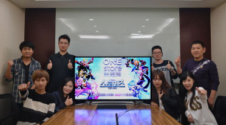

- **\- 정식 출시에 맞춰 5,000만원 상당 마케팅 지원키로**
- **\- 다음 베타테스트는 11월 14일부터 25일까지 진행 예정**

원스토어 주식회사(대표: 이재환)는 에너지스톤게임즈의 '스토머즈 : 마지막생존자(이하 스토머즈)'를 10월의 우수베타게임으로 선정, 원스토어 출시 시 5,000만원 상당의 마케팅을 지원하기로 했다고 밝혔다.

'스토머즈'는 3D 액션 RPG 게임으로써 공허 코어와 스톰 갤럭시의 비밀을 찾아 떠나는 내용을 담고 있다. 유저는 메인 캐릭터와 영웅을 함께 육성하며 원하는대로 영웅을 조합할 수 있으며, 전투 중에 강력한 메카로 변신하는 신선한 변신 시스템을 도입하여 참신한 경험을 제공한다는 평을 받았다. '스토머즈'는 오는 11월 원스토어를 통해 선출시될 예정이며, 현재 원스토어와 '스토머즈' 공식웹사이트에서 사전예약 접수를 받고 있다.

베타게임존은 올해 6월 통합 출범한 원스토어가 중소개발사들과의 동반성장을 위해 3년간 100억원을 투자하겠다고 밝히며 시작한 베타테스트 지원 프로그램으로써, 10월까지 40개 이상의 개발사들이 참여했다. 특히, 이 중 이츠게임즈의 '아덴'과 넥스트무브의 '아케론모바일'은 베타테스트 이후 시장에 성공적으로 안착한 대표적인 게임으로 베타게임존이 단순히 테스트를 지원하는데 그칠 뿐만 아니라, 원스토어 선출시를 기반으로 초반 커뮤니티 형성, 씨드 유저 확보 및 게임 마케팅에도 도움을 줘 게임의 성공 가능성을 높이는데 기여하고 있음을 보여주고 있다.

원스토어 주식회사의 이재환 대표는 "베타게임존이 제대로 조명받지 못한 채 쉽게 외면받을 수 있는 환경에 있는 양질의 중소개발사 게임들이 첫 걸음을 내딛을 수 있는 통로가 되어 주고 있다"며 "원스토어가 앞으로도 다양한 개발사 지원과 이용자 편의를 고민하여 개발사와 이용자 모두에게 돌아가는 혜택을 늘려주겠다"고 밝혔다.

다음 베타테스트는 오는 11월 14일(월)부터 25일(금)까지 12일간 진행될 예정이다. 유저가 베타게임존 게임을 다운받아 플레이 후 설문을 작성하면 이 중 최대 100명에게 원스토어 게임 캐쉬 1만원이 제공되며, 우수베타게임으로 선정되는 게임에는 정식 출시 시 5,000만원 상당의 마케팅 지원이 제공될 예정이다. 보다 자세한 내용은 원스토어 개발자센터에서 확인할 수 있다.

더불어 원스토어는 11월 인디게임존 전시작 12종을 공개 및 전시 중이다. 전시작은 초시공 돌격대(퀀텀비트), 물약을 지니리(소켓게임즈), 파워레인저 대시(무브게임즈), 샐리의 법칙(나날이스튜디오), 환생만이살길(미스터게임즈), 잉어왕 창업전쟁(V2R), 프리스타일야구2(다에리소프트), 로스트 건즈(슈퍼캣), 미사일 키우기(레트로 박스), 딤라이트(산배), 니그레도 라비린스(테일스샵), 메카닉 에스케이프(플레이디지어스)이다.
