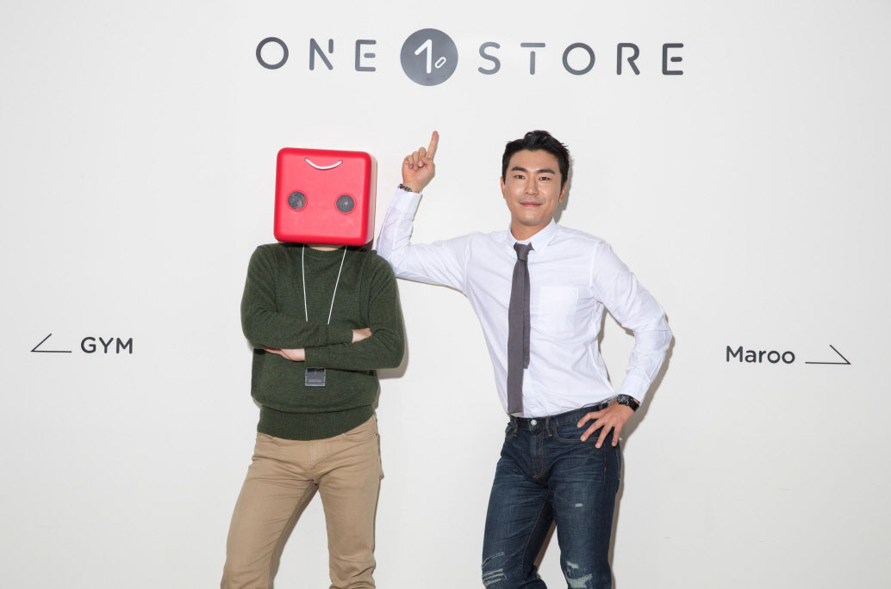

원스토어 주식회사(대표 이재환)는 나혼자산다, 진짜사나이를 통해 대세 반열에 합류한 배우’이시언’을 원스토어 광고모델로 발탁했다고 전했다.

금번 원스토어에서 선보일 광고는 경쟁사 대비 보다 높고 다양한 혜택을 제공하는 자사의 경쟁력을 위트있는 메시지로 광고에 풀어냈다. 특히 코믹한 연기가 일품인 배우 이시언과 원스토어의 캐릭터 '혜택이'의 케미는 또 하나의 관전 포인트다. 이번 광고는 총 3개의 시리즈로 구성되어 있으며, 지난 5일 티저가 선 공개된 후 금일 첫 본편인 '적립보행 편'이 온-에어 된다. 이후 12월까지 순차적으로 2편과 3편이 공개될 예정이다.

원스토어는 이동통신3사 앱스토어(T스토어, 올레마켓, U+스토어)와 네이버 앱스토어를 통합한 국내 토종 앱 마켓으로 할인쿠폰 제공, 캐시백, 적립이벤트 등 다양한 프로모션을 펼치며 기존 앱스토어와 차별점을 두고 있다.

한편, 배우 이시언은 나혼자산다 외에도 진짜사나이, SNL8 호스트로 출연 예정이며 신규 드라마 및 영화에서 러브콜을 받고 있는 것으로 알려져 대세 배우임을 입증하고 있다.

원스토어 관계자는"배우 이시언씨가 작품에서 보여준 유머러스한 느낌이 브랜드 이미지와 부합해 모델로 발탁하게 되었으며 실제 촬영도 즐거운 분위기 속에 진행되었다."며 "이시언씨 본인 계정의 인스타그램에도 자발적으로 광고 촬영컷을 올려 팬들과 원스토어와의 자연스러운 교감을 만들어줘 감사하다."고 전했다.

