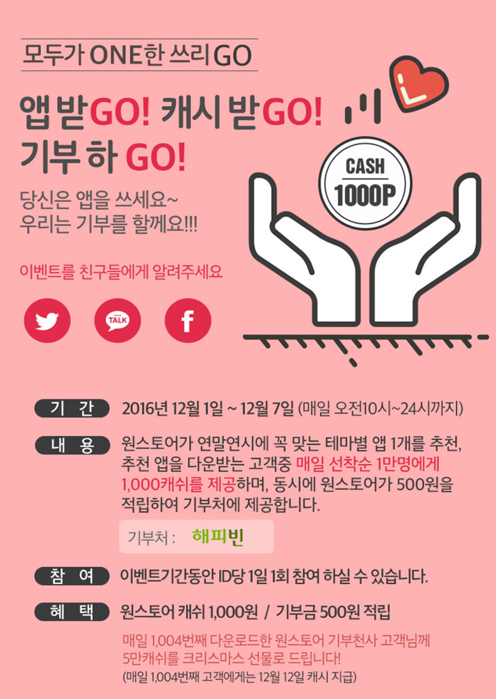

- **\- 앱 다운받을 때마다 선착순 1만명 1,000캐쉬 제공**
- **\- 매일 1,004번째 다운로드 고객에게는 50,000캐쉬 제공**

원스토어 주식회사(대표 이재환)는 오는 7일까지 원스토어에서 특정 앱을 다운로드 받는 고객에게 1,000캐시 증정과 동시에 500원 기부 이벤트를 진행한다. 앱을 다운로드 받는 고객이 많을 수록 원스토어가 기부하는 금액도 커지는 구조다.

이번에 진행되는 기부 이벤트는 원스토어에서 연말연시에 어울리는 테마 별 앱을 1개씩 추천하여 해당 앱을 다운받는 고객 선착순 1만명에게 매일 1,000캐쉬를 제공하는 이벤트이다. 더불어 원스토어는 다운로드 고객 1명 당 500원씩 적립해 해피빈 측에 제공할 예정이다.

또한, 매일 1,004번째로 다운로드 받은 원스토어 기부천사 고객에게는 크리스마스 선물로 5만 캐쉬를 선물할 예정이다. 제공된 원스토어 캐쉬는 현금처럼 자유롭게 사용할 수 있는 포인트로 지급일 기준 일주일 내 사용이 가능하다.

이번 기부이벤트를 기획한 원스토어 관계자는 "원스토어를 사랑하는 많은 고객의 성원에 감사 드린다는 의미로 기획하였으며, 향후에도 원스토어를 이용하는 많은 고객들이 만족할 수 있는 다양한 이벤트를 마련하겠다"고 전했다.

한편, 원스토어는 지난 6월 통신 3사 앱스토어와 네이버 앱스토어 통합 런칭 이후 두달만에 거래액이 30% 급성장하며 눈길을 끌었다. 또한 최근에는 나혼자산다 대세배우 이시언을 광고 모델로 발탁해 유머러스한 광고로 적극적인 시장공략을 펼치고 있다.

