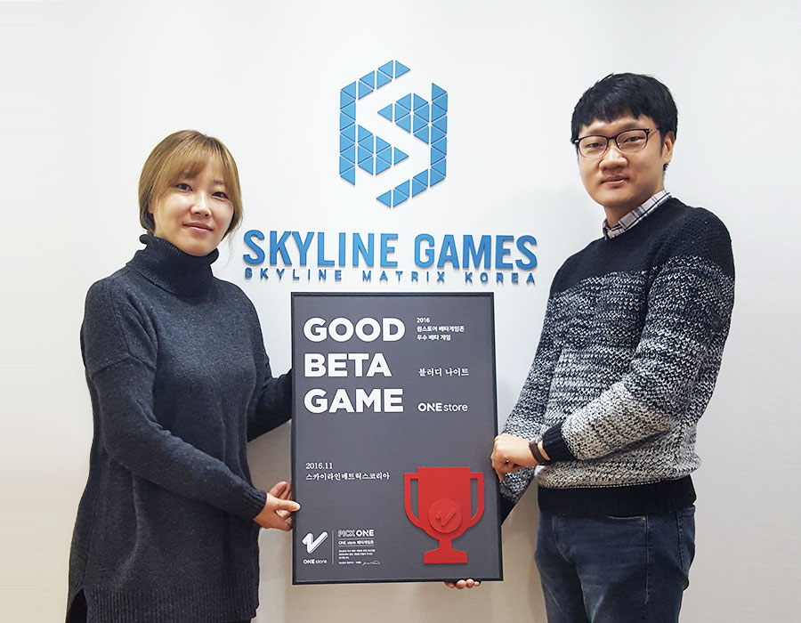

- **\- 정식 출시에 맞춰 5,000만원 상당 마케팅 지원키로**
- **\- 다음 베타테스트는 12월 12일부터 2주간 진행 예정**

원스토어 주식회사(대표: 이재환)는 스카이라인매트릭스코리아의 '블러디 나이트'를 11월 우수베타게임으로 선정, 원스토어 출시 시 5,000만원 상당의 마케팅을 지원하기로 했다고 밝혔다.

'블러디 나이트'는 중국 유명 판타지 소설 '영야제국'의 스토리를 게임에 녹여낸 것이 특징으로 악당에 의해 고통받은 주인공이 복수를 다짐하며 동료들과 시련에서 이겨내는 과정을 담았다. 궁극의 필살기로 한번에 제압하는 명총 스킬, 캐릭터 위치에 따라 역할별 스킬을 통해 콤보 및 연계 공격하는 액션성 등 시원한 타격감의 액션 RPG 게임이다. '블러디 나이트'는 지난 11월 베타게임존의 테스트 결과를 바탕으로 개선작업을 거쳐 원스토어를 통해 선출시될 예정이다.

다음 베타테스트는 오는 12월 12일(월)부터 25일(일)까지 14일간 진행될 예정이다. 유저가 베타게임존 게임을 다운받아 플레이 후 설문을 작성하면 이 중 최대 100명에게 원스토어 게임 캐쉬 1만원이 제공되며, 우수베타게임으로 선정되는 게임에는 정식 출시 시 5,000만원 상당의 마케팅 지원이 제공될 예정이다. 보다 자세한 내용은 원스토어 개발자센터에서 확인할 수 있다.

이와 더불어 원스토어는 12월 인디게임존 선정작 12종을 공개했다. 12월 인디게임존 선정작은 오락실 신야구(플랜비게임즈), 작대기 영웅들(가온미르), 써클링크(주식회사펄스), 비욘드 테일(미스트게임즈), 용사는 진행 중 어드밴스드(버프스튜디오), 픽미업 - 대통령 만들기(스티키핸즈), 도트 히어로 II(미스터게임즈), 홈런킹(리젠소프트), 낭만카페(아울로그), 졸지에용사(허니듀), 아슬아슬 친구관계(애플민트), 스노우레인 2(게임데이)이며, 전시기간 동안 다운로드하는 게이머에게는 1,000원 상당의 보상이 제공된다.

원스토어 주식회사의 이재환 대표는 "국내 모바일 게임사들이 제작환경에서 마주하는 다양한 장애요소들을 마켓단에서 해소해 줄 수 있는 방법들을 끊임 없이 고민하고 있다"고 언급하며, "앞으로도 원스토어는 개발사들의 목소리에 귀 기울이고 이들과의 동반성장을 위해 베타게임존과 인디게임존을 포함한 여러 지원 프로그램들을 다듬고 진행해 나갈 방침이다"라고 밝혔다.
