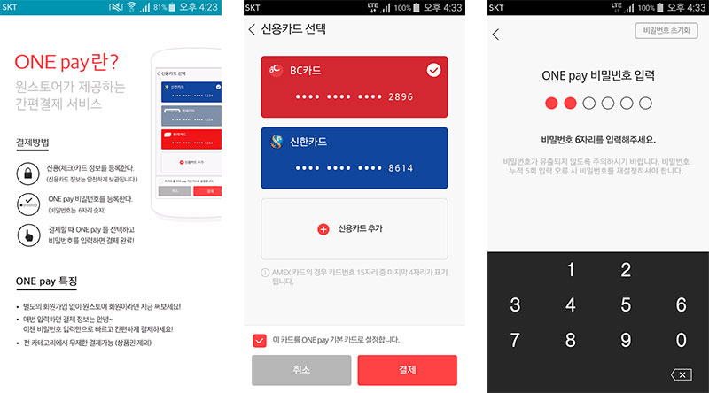

- **\- 신용카드 정보 1회 등록만으로 간편결제 가능**
- **\- 구글플레이 대비 더욱 편리한 결제환경 제공**
- **\- 3종 게임에서 ONE pay 결제금액의 30% 게임캐쉬 적립 이벤트 진행**

원스토어 주식회사(대표 이재환)는 ONE pay가 출시 1개월 만에 원스토어의 대표 간편결제수단으로 자리잡았다고 밝혔다. 2016년 12월 12일 런칭한 ONE pay는 원스토어 회원 3,400만명 누구나 이용할 수 있는 신용카드 기반의 간편결제 서비스로, 카드정보를 한번만 등록해 놓으면 결제시점에는 6자리 비밀번호만으로 결제가 가능하다. 매번 카드정보를 새로 입력하거나, 결제를 위해 별도의 전용 앱을 이용하는 등 최대 5단계를 거쳐야 했던 기존 방식을 2단계로 대폭 간소화한 것이 가장 큰 장점이다.

원스토어 측은 ONE pay를 통해 원스토어의 강점이었던 결제편의성이 한번 더 업그레이드됐다는 입장이다. 앱스토어 가운데 가장 다양한 결제수단을 지원하고 있으며, 통신사멤버십과 신용카드 혹은 문화상품권과 휴대폰요금 등 두 개 이상의 결제수단을 이용하는 소위 '복합결제' 기능을 제공해 왔는데, 이번 ONE pay 도입으로 결제절차까지 더욱 간단해졌기 때문이다.

ONE pay 결제가 가능한 카드는 신한카드, BC카드, 현대카드, 롯데카드, KB국민카드, NH농협카드, 우리카드, 삼성카드이며 서비스 대상 카드사는 지속적으로 확대할 예정이다. 원스토어는 ONE pay 활성화를 위해 뮤오리진, 천명, 아덴 게임에서 ONE pay로 결제 시 결제금액의 30%를 게임캐쉬로 적립해주는 이벤트를 1월 6일부터 3일간 진행하며 이외에도 다양한 이벤트를 진행할 계획이라고 밝혔다.

한편, 원스토어 이재환 대표는 "보다 편리하고 안전한 결제 서비스를 제공하기 위해 지속적으로 노력할 것이며, 신용카드 이외의 결제수단도 ONE pay로 결제할 수 있도록 서비스 범위를 확대해 나갈 것"이라고 전했다.

