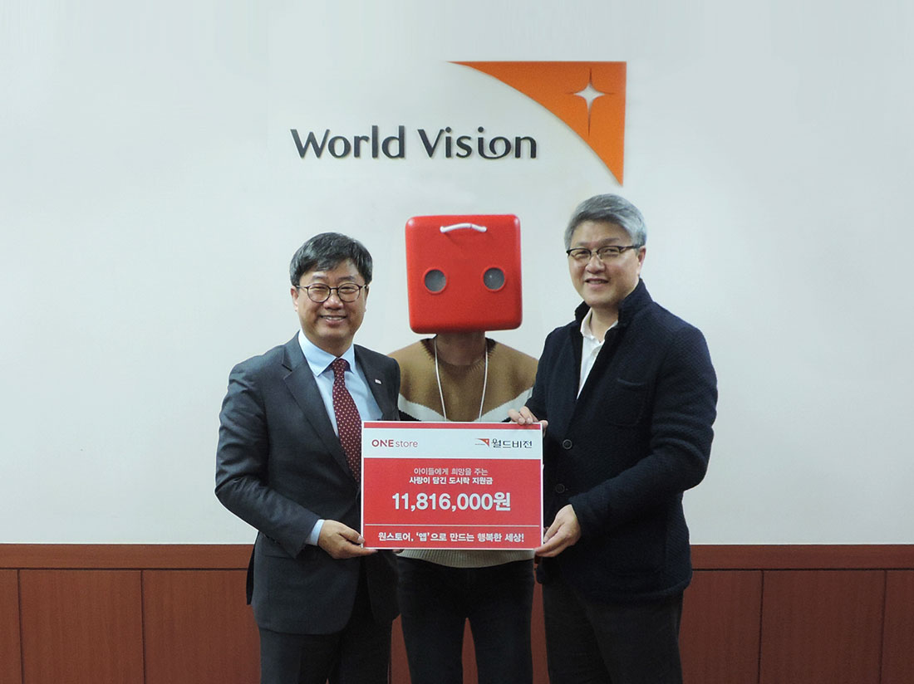

- **\- 12월 기부프로젝트 진행 통해 기부금 약 2,500여 만원 모금돼**
- **\- 네이버 해피빈 통해 월드비전, 행복한동행에 따뜻한 마음 전달**

원스토어 주식회사(대표 이재환)가 지난해 12월 1일부터 7일간 진행한 "모두가 ONE한 이벤트, 앱 받Go, 캐쉬 받Go, 기부 하Go" 기부 프로젝트를 통해 모금된 기부금 25,413,000원을 지난 3일 네이버 해피빈을 통해 전달했다고 밝혔다.

해당 이벤트는 지난 12월 앱 생태계 활성화와 건강한 사회순환 취지에서 기획되었다. 매일 ONE store에서 추천하는 앱을 다운 받은 선착순 1만명에게 ONE Store캐쉬 1,000원을 지급하고, ONE store는 500원을 별도로 적립하여 기부금을 모금하여 사회에 환원하는 구조로 진행된 이벤트였다.

원스토어 유저들도 이번 기부 프로젝트의 취지에 공감한 듯, 기존 대비 다운로드 트래픽이 10배 이상 증가해 일 평균 6만건을 기록하는 등 적극적인 모습을 보였다. 모금된 적립금은 월드비전, 행복한 동행, 해피빈에 전달되어 사회적 소외계층에게 따뜻한 마음을 불어넣었다.

원스토어 박윤서 매니저는 "이번 기부 프로젝트와 같이 사회 환원을 지속 실천해 나갈 계획이며, 앱 다운로드시 일정 금액을 사회에 환원하는 등 건강한 앱 생태계 활성화를 위해 노력할 것" 이라고 전했다.

한편, 원스토어는 작년 6월 런칭 이후 꾸준한 성장을 보이고 있으며 최근에는 배우 이시언을 모델로 혜택이 시리즈 광고와 브랜드 무비 '뜻 밖의 선물'편을 제작 진행하는 등 고객과의 접점을 확장하기 위한 적극적인 마케팅을 펼치고 있다.

