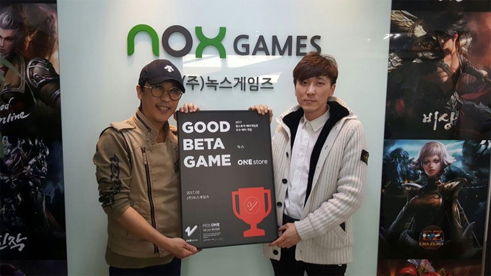
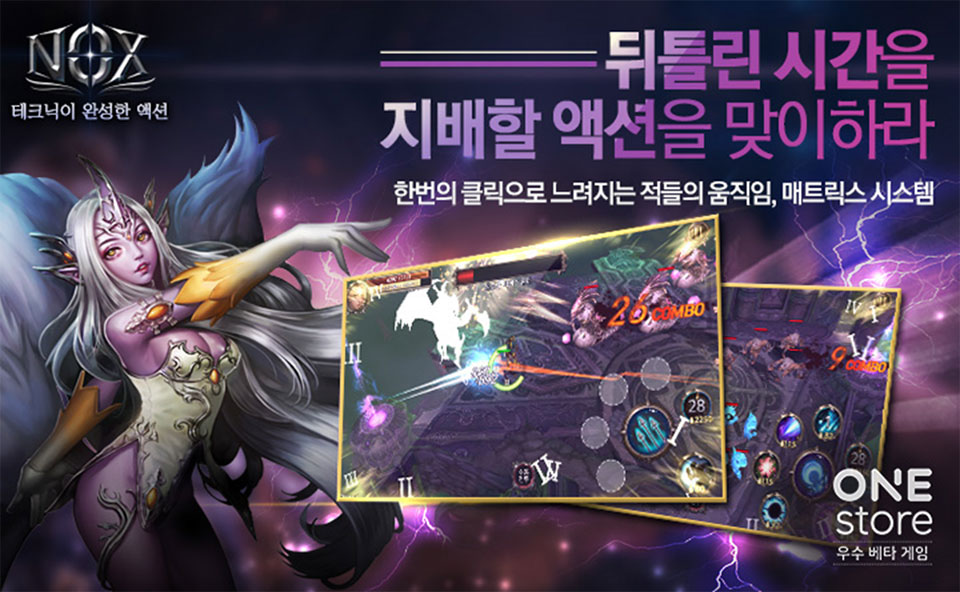

- \- 3월 베타테스트 오는 3월 25일까지 진행 예정

원스토어 주식회사(대표: 이재환)는 (주)녹스게임즈(대표: 홍준수)의 '녹스(NOX)'를 2월의 우수베타게임으로 선정했다고 밝혔다.

‘테크닉이 완성한 액션'을 주요 슬로건으로 내세우는 '녹스(NOX)'는 베타테스트 기간 동안 게임 초반의 빠른 성장과 만렙 이후의 무한 영웅 성장 시스템으로 유저들에게 지루할 틈 없는 재미를 선사하는 한편, 다양한 조합을 통해 전략적으로 활용할 수 있는 '스킬 연계'와 전투 도중 시간의 흐름을 조종하는 '매트릭스 시스템'을 통해 '녹스(NOX)'만의 극대화된 액션을 제공한다는 평을 받았다.  
더불어 '녹스(NOX)'는 원스토어에 단독 출시하여 출시 3일만에 인기게임 1위를 달성하고, 최고매출 순위 상위권을 기록하는 등 베타게임존 이후에도 흥행을 이어가고 있다.

(주)녹스게임즈는 2011년 설립되어 웹과 모바일을 넘나들며 다양한 장르의 게임을 서비스하고 있는 게임 퍼블리싱 전문 회사로써, 현재 '대박온라인', '미인어온라인', '대천사온라인'' 등의 대작 웹게임과 모바일게임인 '녹스', '히든 for Kakao'와 'COD'를 서비스 중이며, 올해 상반기에도 다수의 라인업을 준비 중인 것으로 알려졌다.

(주)녹스게임즈의 홍준수 대표는 "베타게임존 CBT 기간 동안 자사의 게임에 부족한 점과 강점에 대해 유저들의 의견을 직접 들을 수 있어서 많은 도움이 되었다"고 밝히며 "부족한 점이 많았는데 이렇게 많은 사랑을 해주시고 또 좋은 결과가 나오게 되어 기쁘다. 앞으로 기대와 사랑에 더 보답할 수 있도록 노력하겠다"고 말했다.

원스토어 주식회사의 이재환 대표는 "원스토어 베타게임존은 게임 정식 출시 전에 개발사와 퍼블리셔가 운영의 손발을 맞추어 보고, 원스토어 고유의 코어 게이머들을 통해 게임에 대한 피드백을 즉각적으로 받을 수 있는 곳이다"고 밝히며 "베타게임존이 앞으로도 유망 개발사와 퍼블리셔들에게 실질적으로 도움이 되는 테스트배드로써 입지를 다질 수 있도록 노력하겠다"고 밝혔다.

3월의 베타테스트는 현재 진행 중이며, 25일(수)까지 진행될 예정이다. 유저가 베타게임존 게임을 다운받아 플레이 후 설문을 작성하면 게임당 최대 100명에게 원스토어 게임 캐쉬 1만원이 제공되며, 우수베타게임으로 선정되는 게임에는 정식 출시 시 5,000만원 상당의 마케팅 지원이 제공될 예정이다. 보다 자세한 내용은 원스토어 개발자센터에서 확인할 수 있다.

이와 더불어 원스토어는 3월 인디게임존 전시작 8종도 공개 했다. 3월 인디게임존 전시작은 크라이즈(아트스퀘어), 우가차카(뉴게임즈), 리그오브히어로(미그게임즈), 판타지 디펜스2(에쎈모바일테크놀러지), 아이언 대시(마스트게임즈), 여자인걸 왜 모르지?(아이디어박스), 라바히어로즈2(미스터게임즈), 애니멀퍼즐2017(퍼니앱)이다.

해당 게임들은 전시 기간 동안 다운로드 시 1,000원 상당 보상이 제공 된다.
