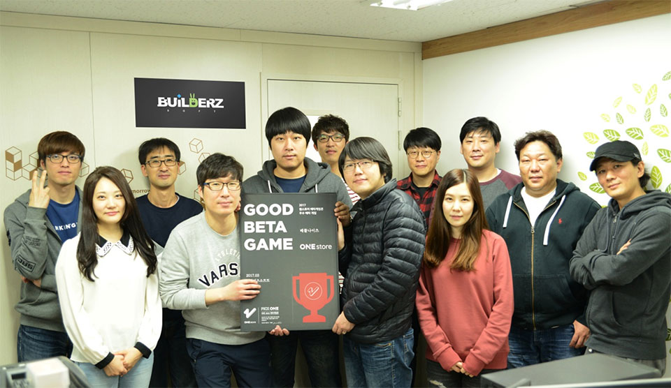
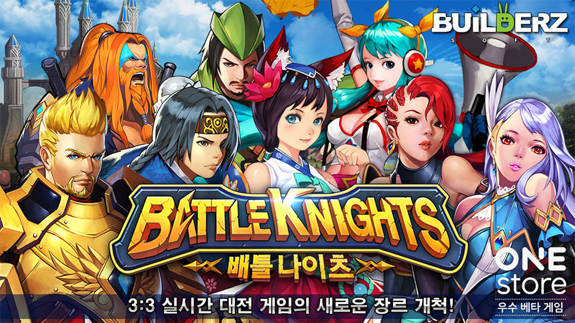

- **\- 4월 베타테스트 오는 4월 12일부터 25일까지 14일간 진행 예정**

원스토어 주식회사(대표: 이재환)는 (주)빌더즈소프트(대표: 이연찬)의 '배틀나이츠'를 3월의 우수베타게임으로 선정, 출시 시 5,000만원의 마케팅을 지원하기로 했다.

배틀나이츠는 보는 게임이 아닌 직접 플레이하며 즐거움을 느껴 보자라는 모토 아래 태어난 실시간 3:3 팀대전 게임으로써, 남녀노소 누구나 쉽게 접근이 가능한 3매치 퍼즐과 게임의 깊이감을 더해주는 RPG 성장 시스템을 더해 실시간 3:3 팀대전 게임을 쉽고 재미있게 풀어냈다는 평을 받았다.

(주)빌더즈소프트는 PC 게임 개발사 출신의 평균 경력 10년 이상의 개발자들이 모여 설립한 모바일 게임 업체이며, 과거 모바일 게임 불멸의전사(레드사하라스튜디오) 시리즈를 개발하여 개발력을 인정 받은 바 있고, 현재 회사의 첫 타이틀인 배틀나이츠를 원스토어에 선출시 중이다.

(주)빌더즈소프트의 이연찬 대표는 "원스토어 배타게임존을 통해 유저의 소중한 의견과 2주간의 테스트 결과를 바탕으로 현재 안정적인 환경에서 서비스 할 수 있게 되었다"고 밝히며, "원스토어 배타게임존에서 배틀나이츠를 서비스 하게 된 건 굉장히 큰 행운이었다 생각하고 있으며, 앞으로도 베타게임존이 계속 운영되어 스타트업 개발사에 소중한 기회를 제공해 주었으면 좋겠다"고 말했다.

한편, 4월 베타테스트는 25일(화)까지 진행될 예정이다. 유저가 베타게임존 게임을 다운받아 플레이 후 설문을 작성하면 게임당 최대 100명에게 원스토어 게임 캐쉬 1만원이 제공되며, 우수베타게임으로 선정되는 게임에는 정식 출시 시 5,000만원 상당의 마케팅 지원이 제공될 예정이다. 보다 자세한 내용은 원스토어 개발자센터에서 확인할 수 있다.

이와 더불어 원스토어는 4월 인디게임존 전시작 8종도 공개 했다. 4월 인디게임존 전시작은 오버터치(더원게임즈), 복싱소녀(개쉬포인트코리아), 퀴즈몬스터:요괴봉인전(파인세븐), 용사모아 타워(핑거캣 게임즈), 언더랜드(넥스트퓨처랩), 궁수의 모험(WS스튜디오), 픽셀 블레이드(픽셀스타 게임즈)와 Gemcrafter(Playmous)이다.

해당 게임들은 전시 기간 동안 다운로드 시 1,000원 상당의 보상이 제공 된다.
