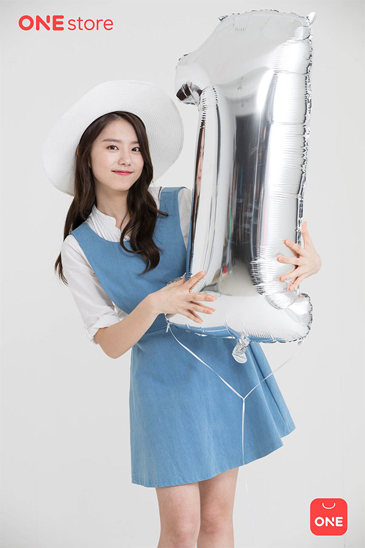

- **\- 6월 국내 앱스토어 통합 1주년 광고 캠페인에서 모델 활약**

원스토어 주식회사(대표: 이재환)는 6월 통합 런칭 1주년을 맞아 집행 되는 광고캠페인의 새로운 모델로 I.O.I 출신 김소혜를 발탁했다.

배틀나이츠는 보는 게임이 아닌 직접 플레이하며 즐거움을 느껴 보자라는 모토 아래 태어난 실시간 3:3 팀대전 게임으로써, 남녀노소 누구나 쉽게 접근이 가능한 3매치 퍼즐과 게임의 깊이감을 더해주는 RPG 성장 시스템을 더해 실시간 3:3 팀대전 김소혜는 공중파 유일의 게임방송인 에서 메인MC로 김희철과 환상 케미를 보여주며 게임유저들 사이에서 '갓소혜'로 사랑 받고 있다. 원스토어는 SBS유희낙락 프로그램의 미디어컨텐츠 파트너로서 다양한 모바일게임을 소개하고 있다.

원스토어 신현일 브랜드매니저는 "소혜양을 유희낙락 촬영장에서 지켜 보면서 연기자로서 잠재된 가능성과 다양한 색깔을 가진 매력이 원스토어의 고객에게 어필할 수 있다고 생각했고, 아직 성장단계인 원스토어와 소혜양의 케미가 잘 맞을 거라고 판단되어 새 모델로 발탁했다"고 전했다.

특히, 엉뚱하지만 사랑스럽고 귀여운 이미지와 유희낙락에서 보여주는 의외의 게임실력으로 원스토어의 핵심층인 젊은 유저와 적극적인 교감을 이끌어 낼 예정이다.

원스토어는 국내 앱스토어 통합 1주년을 맞아 6월 한 달 내내 다양한 혜택을 주는 이벤트를 진행 예정이며 김소혜가 등장하는 원스토어의 새로운 광고 캠페인은 티저와 함께 6월 1일부터 온에어를 시작하였다.
