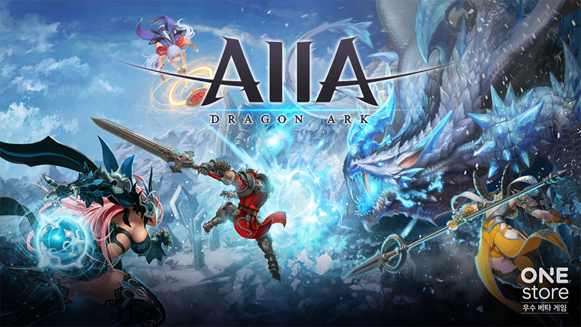

- **\- 6월 베타테스트 이달 25일까지 진행중**
- **\- 베타게임존 운영 1년, 총 52만건 다운로드 달성 및 성과 공개**

원스토어 주식회사(대표: 이재환)는 (주)씨엘게임즈(대표: 최병두)의 '아이아'를 5월의 우수베타게임으로 선정했다고 밝혔다.

아이아(AIIA)는 액션 MORPG 장르로 언리얼4 엔진을 활용하여 모바일에서도 아름답고 화려한 배경과 극강의 타격감을 구현했고 펫 캐릭터인 아르마가 전투에 직접 참여하여 공격 또는 힐 등을 사용하여 플레이어 캐릭터를 돕는 것이 특징이다.

(주)씨엘게임즈는 2008년 2월에 설립된 게임 업체로 아이아를 직접 개발하고 서비스 예정으로 원스토어 베타게임존의 다양한 유저 의견들과 개선점들을 확인하여 반영 후 정식 출시할 예정이다.

씨엘게임즈 관계자는 "원스토어 베타게임존을 통해 예상할 수 없었던 좋은 의견들을 받을 수 있어서 많은 도움이 되었다. 더불어 우수베타게임에 선정되어 매우 기쁘고 기대에 부응할 수 있도록 정식 서비스까지 최선을 다하겠다"라고 말했다.

6월 베타 테스트는 이달 25일(화) 까지 진행되고 유저가 베타게임존 게임을 다운받아 플레이 후 설문을 작성하면 게임당 최대 100명에게 원스토어 게임 캐쉬 1만원이 제공된다. 보다 자세한 내용은 원스토어 개발자센터에서 확인할 수 있다.

2016년 6월 원스토어와 함께 출범한 베타게임존과 인디게임존은 총 52만 다운로드를 기록했고, 국내 소규모 개발사의 등용문으로 자리잡았다.

먼저 베타게임존은 누적 12만 다운로드, 총 106 종 전시, 이 중 12종은 우수베타게임으로 선정하여 5,000만원 상당 추가 마케팅 지원을 했다. 이중 개발사 10곳은 2회 이상 전시하면서 원스토어 베타게임존을 사전 테스트 프로그램으로 적극 활용 중인 것으로 파악 됐다.

인디게임존은 연간 총 110종 전시, 누적 다운로드 40만명을 기록하면서 장르 다변화를 할 수 있었고 원스토어에 개성 있고 신선한 아이디어의 게임들을 출시했다.

원스토어는 6월 인디게임존 전시작 6종도 전시 중이다. 6월 인디게임존 전시작은 재배타운(아울로그), 오목왕(엔트리포), 드래곤 워리어즈(더원게임즈), 쿵따리 고구마(에너지스톤게임즈), 전설의 탑(Zensty), 궁수키우기2(WS스튜디오)이다. 해당 게임들은 전시 기간 동안 다운로드 시 1,000원 상당 보상이 제공 된다.
