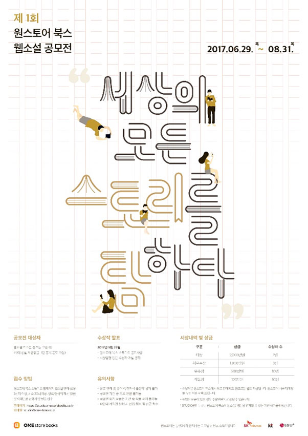

- **\- 국내 최고 수준, 총 상금 1.5억 웹소설 공모전 개최**
- **\- 원스토어, 누구나 작가가 될 수 있는 웹소설 작가 오픈 플랫폼, 원스토어 북스 STUDIO 런칭**

원스토어(이재환 대표)가 새 웹소설/웹툰 작가 오픈 플랫폼 원스토어 북스 STUDIO'를 오픈하고 총 상금 1억 5000만원 규모의 제1회 원스토어 북스 웹소설 공모전을 진행한다고 29일 밝혔다. '원스토어 북스 STUDIO'는 최근 드라마나 영화의 원작으로 각광받는 웹소설 전용 플랫폼으로 29일 오늘 오픈했다.

이번 공모전은 '세상의 모든 스토리를 탐하다'를 주제로 우수한 작품과 창의력을 가진 작가를 발굴하기 위해 열린다. 공모 부문은 모든 장르의 웹소설로 기성, 신인 제한이 없으며 글쓰기를 좋아하는 사람이라면 누구나 응모할 수 있다. 모집 기간은 2017년 8월 31일까지이며, '원스토어 북스 STUDIO' 사이트(https://studio.onestorebooks.co.kr)에서 회원가입을 하고 작품을 연재하면 된다.

수상작 선정은 조회 수, 댓글 수 등 독자의 인기지수를 산출하여 결정하는 방식을 도입했다. 독자가 직접 참여하여 수상작을 결정하기 때문에 작가와 독자 모두에게 의미가 깊다. 수상작 발표는 2017년 9월 29일이다.

시상 내역은 대상 1편 2000만원을 포함하여 64명의 수상자에게 총 상금 1억5000만원이 지급된다. 또, '원스토어 북스 STUIDO' 플랫폼 내 유료 판매에 따른 판매수익까지 기대할 수 있다.

특히, 수상작 중 독자들의 반응이 뜨거운 작품은 전자책으로 출간되어 상금 외에 별도 보장인세가 지급될 예정이다. 이외에도 대중에게 다가설 수 있도록 원스토어에서 마케팅을 지원할 계획이다.

원스토어 이재환 대표는 "원스토어 북스 STUDIO를 통해서 기존 작가의 문법과 형식에 구애받지 않는 파격적이며 자유로운 상상의 힘과 가능성을 가진 일반인 작가 발굴에 큰 기대를 하고 있다"며 "작가의 수익 배분 비율이 타 웹소설 플랫폼 대비 더 높아 좋은 콘텐츠를 가진 작가들의 활발한 참여와 그로 인해 감동을 주는 다양한 이야기의 힘으로 많은 독자에게 사랑받는 선순환 서비스를 제공하는 것이 목표"라고 덧붙였다.

원스토어는 이후로도 공모전을 상시 개최하여 작가 지망생들이 웹소설 뿐 아니라 영화, 드라마 등 다양한 포맷으로 대중에 다가설 수 있도록 지원할 예정이며, 손쉽게 작품을 올리고 독자와 소통하며 프로 작가로 데뷔할 수 있는 기회의 장이 될 것으로 기대하고 있다.
