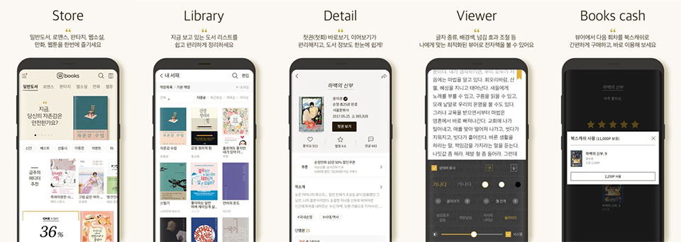

- **\- 7월 한 달간 앱 리뉴얼 기념 다양한 특별 이벤트 진행**
- **\- 유저 편의성 개선을 위한 위한 전체적 UI개편**

원스토어 주식회사(대표: 이재환)는 총 42만 권의 도서를 보유한 국내 최대 전자책 서비스인 '원스토어 북스'가 유저의 편의를 높이고 서비스를 강화하기 위해 지난 10일 전면 리뉴얼 했다고 밝혔다. 또한, 이를 기념해 7월 한 달간 다양한 오픈 이벤트를 진행한다고 밝혔다.

이번에 리뉴얼 된 원스토어 북스 앱은 유저들이 콘텐츠를 쉽게 찾을 수 있도록 도서 리스트 정리, 첫 회 바로보기, 이어보기 같은 기본 기능을 개선하여 전체적인 유저 인터페이스(UI)를 더욱 쉽고 직관적으로 정리했다.

또한, 선호도가 명확하게 구분되는 장르 소설 이용자의 사용 패턴을 반영하여 원하는 소설을 더 빠르게 찾을 수 있도록 로맨스와 판타지를 별도의 패널로 분리했다. 동시에 웹소설/웹툰 패널을 신설해 '원스토어 북스 STUDIO'(https://studio.onestorebooks.co.kr)에 업로드 되는 개인작가들의 작품까지 감상할 수 있다.

한편, 원스토어 북스는 앱 리뉴얼을 기념하여 7월 한 달간 다양한 오픈 기념 이벤트를 진행한다. 이벤트 기간 중 매일 오후 1시 선착순 1천 명에게 원스토어 북스에서 쓸 수 있는 북스캐쉬 1천 원을 제공하며, 북스캐쉬를 충전하면 보너스 포인트를 세 배까지 지급하는 등 다양한 혜택을 제공할 예정이다. 자세한 사항은 원스토어 북스 앱 내 배너 등을 통해 확인할 수 있다.

원스토어 관계자는 "리뉴얼과 함께 풍성해진 콘텐츠를 유저들이 활발히 이용할 수 있도록 이번 이벤트를 준비했다"며 "사용자들의 이용 습관을 반영해 더 다양한 콘텐츠를 편리하게 즐길 수 있도록 지속해서 업데이트할 예정이다"라고 전했다.

한편 원스토어 북스는 지난 6월 29일부터 우수한 작품과 창의력을 가진 작가를 발굴하기 위해 총 상금 1억 5천만원 규모의 '제 1회 원스토어 북스 웹소설 공모전'을 실시하고 있다. 모집 기간은 8월 31일까지이며, '원스토어 북스 STUDIO' 사이트에서 회원가입 후 작품을 연재하고, 이메일(studio@onestore.co.kr)로 신청서와 원고를 접수하면 된다.

원스토어 북스 앱은 원스토어에서 '원스토어 북스'를 검색하면 다운받을 수 있다.
