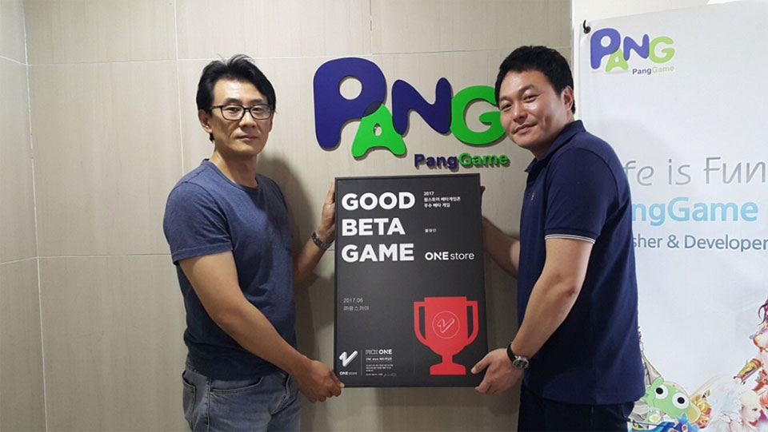

- **\- 7월 베타테스트 이달 25일까지 진행 중**

원스토어 주식회사(대표: 이재환)는 (주)팡스카이(대표: 지헌민)의 ‘불량인’을 6월의 우수베타게임으로 선정했다고 밝혔다.

‘불량인: 황제의 비밀조직’은 동영상플랫폼 유쿠(youku.com)에서 35억뷰 조회를 기록한 애니메이션 '화강호지불량인'을 기반으로 한 모바일 MMORPG(다중접속 역할수행게임)으로, 6월 원스토어 베타게임으로 공개되어 그래픽과 게임성에서 좋은 평을 받은 타이틀이다.

(주)팡스카이는 2012년에 설립된 게임 회사로, 최근에는 독특한 네이밍으로 좋은 실적을 거뒀던 ‘오빠모바일’과, 삼국지기반 모바일전략게임 ‘대황제M’ 등의 모바일게임을 서비스하고 있다.

팡스카이 관계자는 "원스토어 우수 베타 게임에 선정되어 매우 기쁘며, 원스토어 베타게임존을 진행하면서 유저분들의 피드백을 지속적으로 수렴하여 출시 후에도 지금보다 더 좋은 서비스를 제공할 수 있는 팡스카이가 되겠다"고 소감을 전했다.

7월 베타 테스트는 12일(수)부터 25일(화)까지 진행중이고, 유저가 베타게임존 게임을 다운받아 플레이한 뒤 설문을 작성하면 게임당 최대 100명에게 원스토어 게임 캐쉬 1만원이 제공된다. 보다 자세한 내용은 원스토어 개발자센터에서 확인할 수 있다. 

원스토어는 7월 인디게임존 전시작 7종도 전시 중이다. 7월 인디게임존 전시작은 로그 – 항해의 시작(에피드게임즈), 천년의 거신(투엠비게임), 투잡히어로(드래곤스카이), 드루와던전(퀘스트게임즈), 스위트 로드(쿡앱스), 아이러브패션(블루파이), 탭 탱크: 전쟁의 서막(니젠게임)이다. 해당 게임들은 전시기간 동안 다운로드 시 1,000원 상당 보상이 제공된다.
