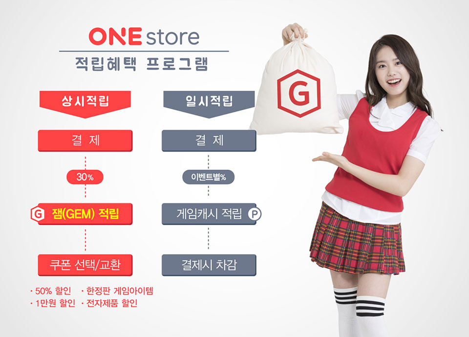

- **\- 게임결제금액의 30%를 ‘잼(GEM)’으로 적립**
- **\- 적립된 ‘잼(GEM)’은 고객 소비패턴에 따라 맞춤형 쿠폰으로 교환**

원스토어 주식회사(대표 이재환)가 원스토어 오픈 1주년을 맞아 다음 달 1일부터 게임결제금액의 30%를 적립했다가 맞춤형 쿠폰으로 교환하는 새로운 적립 프로그램 ‘잼(GEM)’을 신설하고 고객 혜택을 강화한다.

원스토어가 고객에게 제공하는 다양한 ‘재미’를 뜻하는 ‘잼(GEM)’은 많은 고객이 즐기는 최신게임과 인기게임에 보다 높은 적립 혜택을 제공하고자 신설되었으며, 적립된 ‘잼(GEM)’은 고객의 소비 패턴에 맞춰 매월 새롭게 갱신되는 보너스쿠폰팩과 교환하여 사용할 수 있다.

‘잼’ 도입 첫 달에는 50% 할인 쿠폰, 1만원+30% 할인 쿠폰 등 총 5종의 보너스 쿠폰팩을 선보인다. 50% 할인쿠폰과 1만원 할인쿠폰이 주어질 경우, 2만원 이상 결제 고객은 50% 쿠폰을, 2만원 이하 결제 고객은 1만원 쿠폰을 선택함으로써 개인별 높은 할인율 선택과 맞춤형 쿠폰을 고르는 색다른 재미도 느낄 수 있다.

원스토어는 향후 게임 결제 할인쿠폰 외에도 게임 내 한정판 아이템 쿠폰, 원스토어 최신형 전자제품 할인권 등 다양한 형태의 보너스쿠폰을 제공할 예정이며, 유료 결제 고객 외에도 게임 리뷰 작성 고객, 원스토어 지속 방문 고객 등 보다 다양한 고객에게도 ‘잼’을 지급하는 등 혜택의 범위를 확대해 나갈 예정이다.

원스토어 이재환 대표는 “출범 이후 1년간 원스토어 마일리지 제도를 통해 더욱 많은 분이 원스토어를 이용해 게임을 즐기실 수 있도록 노력해왔다”며 “이번 ‘잼’ 도입이 원스토어 고객들이 스스로 혜택을 고를 수 있는 ‘맞춤형 혜택 프로그램’으로 자리 잡을 수 있도록 지속적인 서비스 개편과 이벤트 등을 강화해 나갈 예정이다”라고 설명했다.

한편, 원스토어는 ‘잼(GEM)’ 프로그램 도입을 기념해 신청자 전원에게 1,000 잼을 제공하는 오픈 이벤트를 진행한다.
