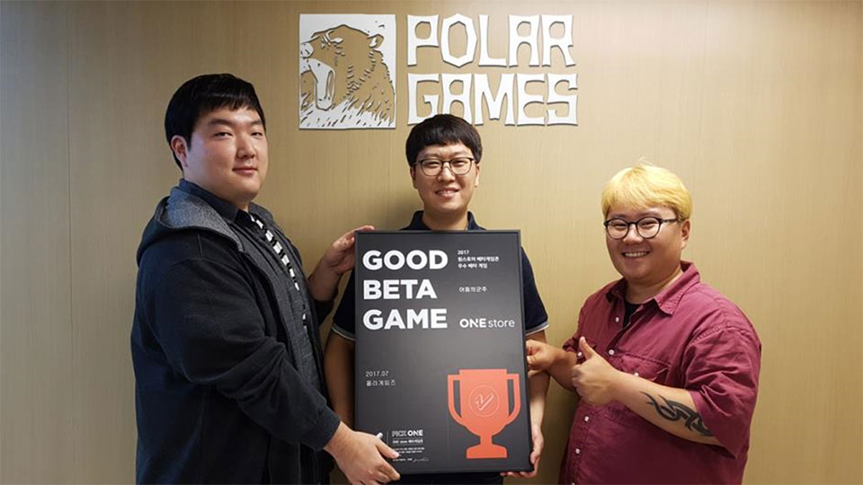

- **\- 8월 베타테스트 11일(금)부터 25일(금)까지 15일간 진행**
- **\- 인디게임의 활성화를 위해 쿠폰 및 캐쉬 보상 상향 조절**

(주)원스토어(대표: 이재환)는 '어둠의 군주(폴라게임즈)'를 7월의 우수베타게임으로 선정했다고 밝혔다.

'어둠의 군주'는 오픈 필드에서 유저들과 경쟁 또는 협력 플레이 하고 필드에서 보스 레이드를 즐길 수 있는 정통 MMORPG이다. 레벨에 따른 변신 시스템을 통해 새로운 캐릭터를 플레이하는 재미를 느낄 수 있으며, 그 외 탄탄한 스토리에 기반한 스토리 던전과 무한의 탑, 싱글 던전 등 기본 콘텐츠를 비롯해 토벌전, 콜로세움 등 다양한 콘텐츠 제공이 특장점이다.

(주)폴라게임즈의 대표 이지광은 '원스토어 베타게임존 등록 후 많은 유저분들이 관심을 가져주셔서 매우 감사하게 생각한다. 어 매우 기쁘게 생각한다' 며 '베타 유저의 피드백을 적극 수렴해 정식오픈 시에는 테스트 때 보여드리지 못했던 거래소시스템과 파티시스템, 유저간 필드PK 등 새로운 콘텐츠도 지속적으로 선보이겠다'고 안내했다.

한편, 2016년에 설립된 신생 회사 '(주)폴라게임즈'는 20여명의 베테랑 게임 개발자들로 이루어진 전문 모바일 게임개발사다. 첫 개발 게임인 '어둠의 군주'가 한국모바일게임협회와 원스토어가 주최하는 '제2회 원스타 발굴 프로젝트' 국내외 부문 1위에 선정되며 우수한 개발력을 인정 받은 바 있다.

또한, 원스토어는 8월부터 인디게임의 활성화를 위해 인디 게임 전용 카테고리 '인디게임존'의 다운로드 이용자들에게 지급하던 캐쉬백을 1,000원에서 2,000원으로 상향 조절한다. 8월 '인디게임존' 전시작은 다크세이비어(코어크리에이티브), 서울핫: 연예인 키우기(Extraordinary Artist Group), 던전돌파 히어로즈(링크타운)이다.

8월의 '베타게임존'은 11일(금)부터 25일(금)까지 진행하며 자세한 내용은 원스토어 개발자센터에서 확인할 수 있다.
