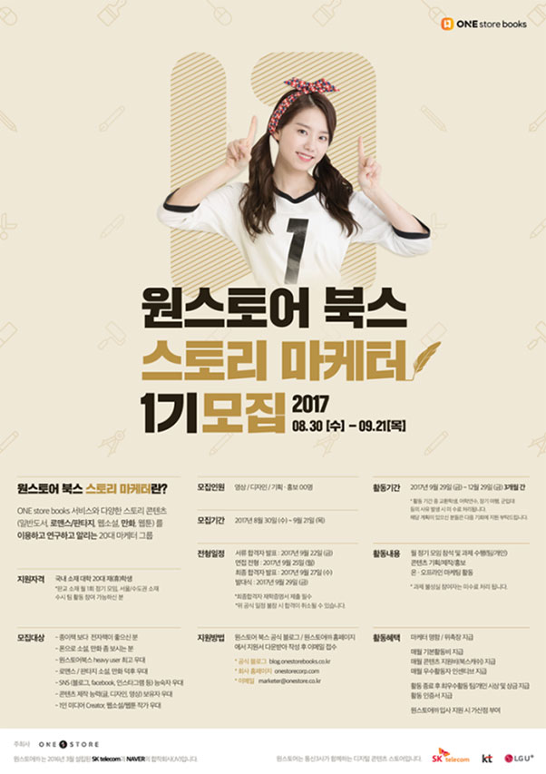

- **\- 3개월 간 스토리 콘텐츠 기획 및 마케팅 참여 기회 제공**
- **\- 우수 활동자는 추후 원스토어 입사 지원 시 가산점 부여**

(주)원스토어(대표: 이재환)가 20대 대학생을 대상으로 '원스토어 북스 스토리 마케터'를 오는 21일(목)까지 모집한다.

'원스토어 북스 스토리 마케터'는 원스토어가 소설, 만화, 웹툰 등 스토리 콘텐츠를 즐기는 대학생들과 함께 소통하고, 콘텐츠 마케팅 실무 경험을 제공하기 위해 올해 처음으로 신설한 대학생 마케터 프로그램이다.

선발된 이들에게는 매달 콘텐츠 지원비를 비롯한 소정의 활동비가 지급되며 원스토어 북스의 다양한 서비스 체험과 함께 콘텐츠 기획부터 마케팅 전반을 경험할 수 있는 기회가 제공된다. 최우수 활동자에게는 시상 및 상금을 수여하며 향후 원스토어 입사 지원 시 가산점을 부여한다.

영상, 디자인, 기획 및 홍보 세 가지 분야로 모집하며 온라인, 모바일을 통해 소설, 만화 등을 즐기는 국내 20대 대학생이라면 누구나 지원 가능하다. 지원 방식은 원스토어 북스 공식 블로그(blog.onestorebooks.co.kr)와 원스토어 홈페이지(www.onestorecorp.com)를 통해 지원 양식을 내려 받고 이메일(maketer@onestore.co.kr)로 지원하면 된다.

1차 서류심사와 2차 면접 전형을 거쳐 선발되는 '원스토어 북스 스토리 마케터'' 1기는 오는 9월 29일 발대식을 시작으로 10월에서 12월까지 3개월간 활동할 예정이다.

원스토어 관계자는 "원스토어 북스 스토리 마케터’는 콘텐츠 마케팅을 꿈꾸는 대학생들에게 기발한 아이디어를 구현할 수 있는 장을 펼쳐주고, 실무를 경험할 수 있도록 마련되었다"며, "이번 1기 스토리 마케터 활동을 시작으로 20대의 공감을 이끌어 낼 수 있는 다양한 콘텐츠와 서비스를 제공할 계획"이라고 전했다.
