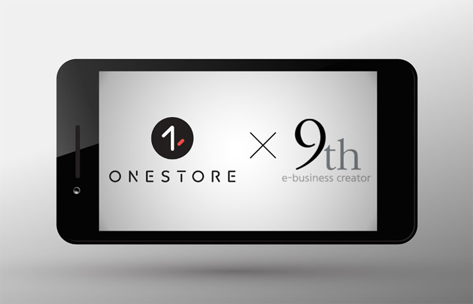

- **\- '크로스애즈' 통해 원스토어 출시 게임 상호간 사용자 유치 가능**
- **\- 9월 한 달 간 게임당 최소 2,500건의 설치형 광고 집행 비용 지원**

원스토어 주식회사(대표 이재환)가 크로스마케팅 플랫폼 '크로스애즈'를 서비스하는 광고플랫폼 전문기업 (주)나인스(대표 서경동)와 마케팅 제휴를 맺고 국내 모바일 게임개발사 마케팅 지원 강화에 나선다.

양사는 모바일 게임 개발에 평균 1년 이상이 소요되는 것에 비해 유의미한 매출이 발생하는 기간은 6개월에 불과하다는 것에 착안, 게임개발사에게 수명주기 내에 개발비용을 회수할 수 있는 효과적인 마케팅수단을 제공해 안정적인 게임 개발 생태계를 조성하고자 이번 마케팅 제휴를 맺었다.

마케팅 제휴 프로모션의 일환으로 9월 한 달 동안 원스토어는 (주)나인스가 개발한 원스토어 전용 모바일 게임 크로스마케팅 플랫폼 '크로스애즈'를 이용하는 회사에게 최소 2,500건의 설치형 광고 집행 비용을 지원한다.

올해 9월 서비스를 오픈한 '크로스애즈'는 게임 내 설치형 광고(CPI)를 통해 상호간 신규 사용자 유치를 도울 수 있는 광고 플랫폼이다. 장르 별 타겟팅이 가능해 동일 장르에 관심도가 높은 게임 사용자에게 설치를 유도할 수 있어 더욱 효율적이다.

원스토어 강준규 사업본부장은 "게임개발사의 마케팅 부담을 덜고자 원스토어 단독으로 지원해 온 마케팅을 보완 가능한 '크로스애즈'와 제휴를 진행하게 되었다"며 "이번 '크로스애즈' 지원을 시작으로 전문적인 마케팅 기업들과 함께 설치형 광고, 사전 예약 등 다양한 마케팅 수단을 제공해 국내 모바일 게임회사와 상호 발전할 수 있는 기회를 확장해 나가겠다"고 전했다.

(주)나인스의 서경동 대표는 "유일한 국내 마켓인 원스토어가 더욱 빠르게 활성화되길 바라며, 마케팅 비용에 부담을 느끼는 중소규모의 게임 개발사의 발전을 위해 원스토어와 함께 아낌없는 마케팅을 지원하겠다"며 포부를 밝혔다.
