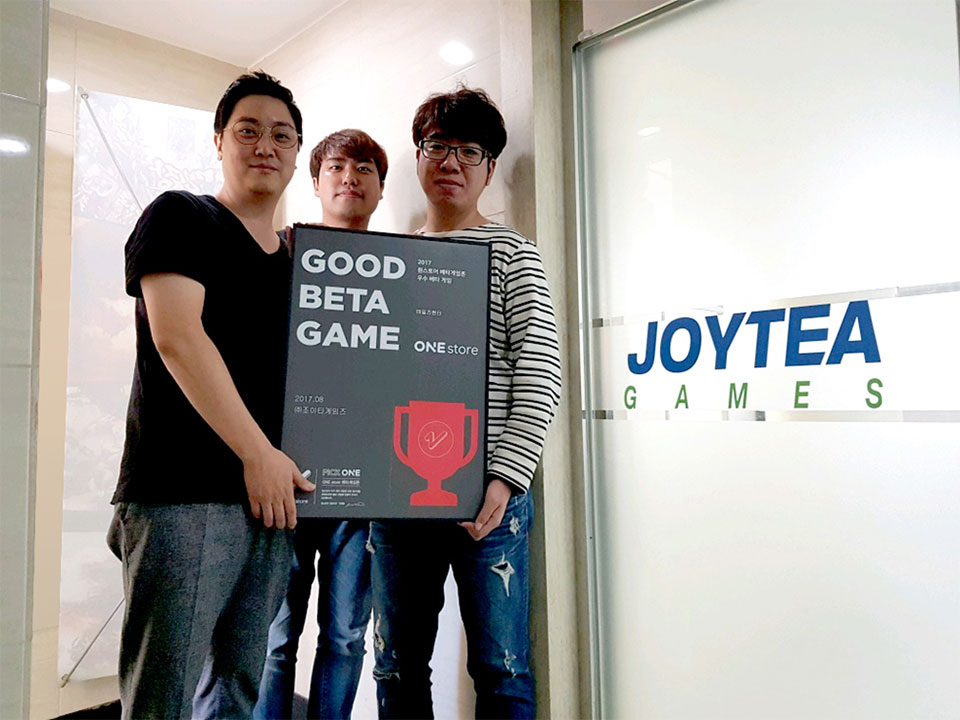

- **\- 9월 베타테스트 12일(화)부터 25일(월)까지 14일간 진행**
- **\- 인디게임존 9월 전시작 3종 공개**

(주)원스토어(대표 이재환)는 (주)조이티게임즈(대표 송제중)의 '테일즈헌터'를 8월의 우수베타게임으로 선정했다고 밝혔다.

'테일즈헌터'는 수준 높은 3D 그래픽으로 구현된 MMORPG 게임으로 친구들과 함께 플레이할 수 있는 기사단 시스템이 가장 큰 특징이다. 동화 구성의 스토리가 돋보이는 시나리오 모드, 멘토링 시스템, PVP, PVE 던전 등 다양한 콘텐츠를 제공하고 있다.

(주)조이티게임즈 대표 송제중은 "원스토어 베타게임존 우수베타게임으로 '테일즈헌터'를 선정해주신 유저 분들께 감사드린다"며 "정식 서비스 전까지 게임의 완성도를 높이고 공식 카페를 통해 게임에 대한 다양한 정보와 이벤트를 투명하게 제공해 유저들의 기대에 부응할 수 있도록 하겠다"고 전했다.

2016년 10월에 설립된 (주)조이티게임즈는 MMORPG인 '아수라' 출시 이력이 있는 베테랑 개발사로 이번 '테일즈헌터' 출시를 통해 게임의 명가로 도약하고자 한다.

9월 베타게임존은 12일(화)부터 25일(월)까지 진행되며 베타게임존 게임을 다운받아 플레이하고, 설문을 작성한 유저 중 게임 당 최대 100명에게 원스토어 게임 캐쉬 1만 원을 제공한다. 보다 자세한 내용은 원스토어 개발자센터(바로가기)에서 확인할 수 있다.

한편, 원스토어는 9월 인디게임존 전시기간 동안 전시작을 다운로드하는 유저에게 2,000원 상당의 보상을 제공한다. 9월 전시작은 신의 기사단(피닉스게임즈), 몬스터 벽돌 깨기 히어로(노리온), 스위쉬(플렉스볼) 3종이다.
