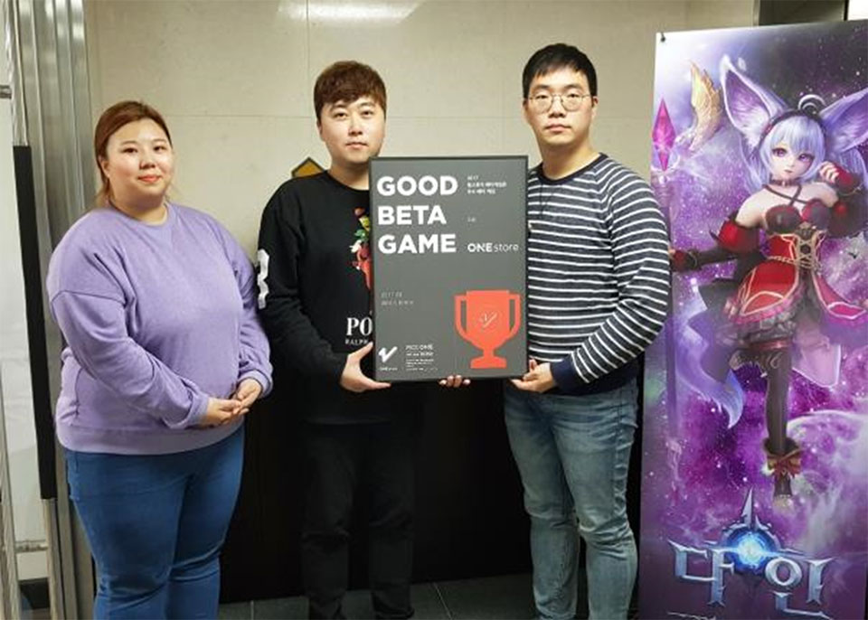

- **\- 10월 베타테스트 12일(목)부터 25일(수)까지 14일간 진행 예정**
- **\- 인디게임존 10월 전시작 공개**

(주)원스토어(대표: 이재환)는 (주)넥스트무브(대표: 정호영)의 '다인'을 9월의 우수베타게임으로 선정했다고 밝혔다.

'다인'은 좌중을 압도하는 풀3D의 화려한 그래픽과 자유도가 높은 논타겟팅 스킬 액션이 특징인 게임이다. 광활한 오픈필드로 구성된 월드맵의 세계관에 따라 양립하는 질서 진영과 혼돈 진영이 분단된 형태로 존재하여 세력 내 이용자끼리 더욱 강한 결속력을 느낄 수 있다. 또한, 이에 따른 진영전, 길드전, 필드 분쟁도 '다인'이 선사하는 강한 매력 포인트이다.

(주)넥스트무브 대표 정호영은 "다인이 원스토어 우수베타게임으로 선정되어 감사 드리고 참여해 주신 유저 분들의 소중한 피드백을 수렴하여 정식 오픈 시에는 더 좋은 서비스를 제공할 예정이니 많은 기대 부탁 드린다"고 전했다.

(주)넥스트무브는 엔터테인먼트, 영화·드라마 제작, 마케팅, 모바일 게임 운영·퍼블리싱 등 다양한 영역의 스페셜리스트 조직으로 구성된 모바일 사업 기반 콘텐츠 및 플랫폼 제작·배급 종합 엔터테인먼트 기업이다. 주요 타이틀로는 여우비, 헤븐, 아케론, 창조의법칙 등이 있다.

10월 베타게임존은 12일(목)부터 25일(수)까지 진행되며 유저가 베타게임존 게임을 다운받아 플레이 후 설문을 작성하면 게임 당 최대 100명에게 원스토어 게임 캐쉬 1만 원을 제공한다. 보다 자세한 내용은 원스토어 개발자센터(바로가기)에서 확인할 수 있다.

또한 원스토어는 10월 인디게임존 전시작 4종 창기사키우기(15pluto), 시드 이야기(싱타), 미래구원자:반격(골든피그엔터테인먼트), 솔리더스(유스티스)를 전시 중이다. 전시 기간 동안 해당 게임 다운로드 시 2,000원 상당 보상이 제공 된다.
