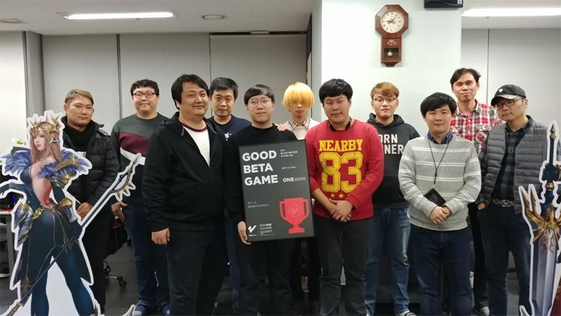

- **\- 11월 베타테스트, 13일부터 25일까지 13일간 진행 예정**
- **\- 인디게임존 11월 전시작 공개**

(주)원스토어(대표: 이재환)는 (주)엔제이인터렉티브(대표: 박인제)의 '펠로우 for Kakao'를 10월의 우수베타게임으로 선정했다고 밝혔다.

'펠로우 for Kakao'는 PC게임을 즐기는 듯한 화려한 그래픽과 생동감 있는 전투가 특징인 MMORPG 게임이다. 지상, 공중, 수중을 자유롭게 돌아다닐 수 있는 Full 3D로 구현된 광활한 세계와 PC게임에서 느낄 수 있는 레이드 모드의 공략 및 파밍 요소로 기존 게임에서 느껴보지 못한 새로움과 자유로움을 제공하고 있다.

(주)엔제이인터렉티브 대표 박인제는 "'펠로우 for Kakao'가 원스토어 우수베타게임으로 선정되어 깊은 감사를 드리며, CBT를 통해 보여드린 것 이상을 정식 오픈 시에 보여드릴 예정이니 많은 관심과 기대 부탁드린다"고 전했다.

10년이 역사를 가진 중견 개발사 (주)엔제이인터렉티브는 PC시절부터 MMORPG 개발 노하우를 보유한 정통 게임 개발사이다.

11월 베타게임존은 13일(월)부터 25일(토)까지 진행되며 유저가 베타게임존 게임을 다운받아 플레이 후 설문을 작성하면 게임당 최대 100명에게 원스토어 게임 캐쉬 1만원을 제공한다. 보다 자세한 내용은 원스토어 개발자센터(바로가기)에서 확인할 수 있다.

또한 원스토어는 11월 인디게임존 전시작 3종인 '지구대난투 : 어스키퍼의 서막(Rawhand)', '창업전쟁(V2R)', '해상전투 : 고스트쉽.io(엔드리스게임즈)'을 전시한다. 전시 기간 동안 해당 게임들을 다운로드 할 경우 1,000원 상당 보상이 제공 된다.
