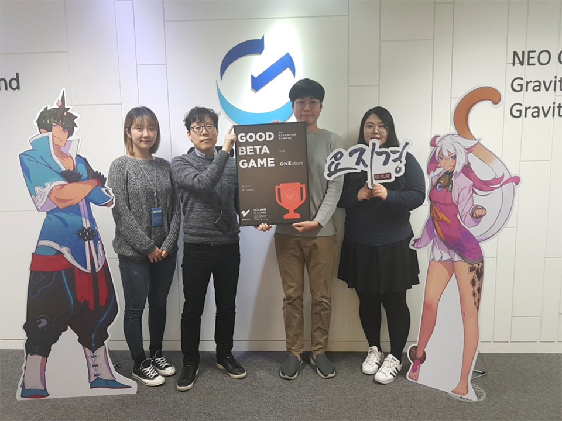

- **\- 12월 베타테스트, 12일부터 25일까지 14일간 진행 예정**
- **\- 인디게임존 12월 전시작 공개**

(주)원스토어(대표: 이재환)는 (주)그라비티(대표: 박현철)의 '요지경'을 11월의 우수베타게임으로 선정했다고 밝혔다.

'요지경'은 중화권에서 인기 높은 콘텐츠 '선검기협전'의 게임 및 드라마 지적재산권(IP)을 활용한 모바일 역할수행게임(RPG)이다. 특히, 동양적 판타지의 세계관과 카툰 랜더링 그래픽, 박진감 넘치는 액션감은 물론 국내 정상급 성우 50여 명의 수준 높은 더빙 참여로 몰입감과 높은 게임성을 자랑한다.

(주)그라비티 대표 박현철은 "'요지경'이 원스토어 우수베타게임에 선정되어 매우 뜻 깊게 생각하고, 깊은 감사를 드린다"며 "오는 14일 정식 서비스 이후에도 유저들에게 사랑 받을 수 있도록 게임의 완성도를 높이는데 최선을 다하겠다"고 전했다.

(주)그라비티는 국내 게임 기업으로는 유일하게 나스닥에 직상장 되어 있는 글로벌 게임 회사로 MMORPG '라그나로크 온라인'의 국내외 서비스를 비롯해 다양한 장르의 모바일 게임과 IPTV용 기능성 게임을 서비스하고 있다.

12월 베타게임존은 12일(화)부터 25일(토) 동안 진행 예정이고, 베타게임존 게임을 다운받아 플레이한 후 설문을 작성한 유저 중 게임 당 최대 100명에게 원스토어 게임 캐쉬 1만원을 제공한다. 보다 자세한 내용은 원스토어 개발자센터(바로가기)에서 확인할 수 있다.

또한 원스토어는 12월 인디게임존 전시작 4종도 전시 중이다. 12월 인디게임존 전시작은 'OX 퀴즈 서바이벌 100(버즈파우더)', '무림소녀(이오션소프트)', '탑탑탑(녹스게임즈)', '좀비로 지구정복(빠찌게임즈)'이다. 해당 게임을 전시 기간 동안 다운로드 할 경우 1,000원 상당의 보상이 제공 된다.
