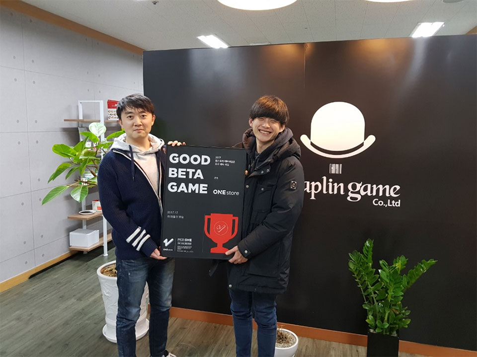

- **\- 1월 베타테스트, 1월 12일부터 25일까지 14일간 진행 예정**
- **\- 인디게임존 1월 전시작 공개**

(주)원스토어(대표: 이재환)는 (주)채플린게임(대표: 오영일)의 '군림'을 12월의 우수베타게임으로 선정했다고 밝혔다.

'군림'은 PK 중 사망한 플레이어가 떨어뜨린 장비를 승자가 경매장에서 판매할 수 있는 등 치열한 PK(Player Killing, 유저간 전투)에 특화된 시스템이 돋보이며, 유저의 피드백을 빠르게 반영하는 착한 운영과 화려한 이펙트, 호쾌한 타격감이 뛰어난 MMORPG 게임이다.

(주)채플린게임 대표 오영일은 "군림이 원스토어 우수베타게임으로 선정되어 감사드리고, 앞으로도 군림만의 고유한 PK시스템을 발전시켜나갈 예정이오니 많은 기대를 부탁드린다"고 전했다.

(주)채플린게임은 2016년 12월에 설립되어 방치형 전함 RPG '해전25시', 실시간 카드 RPG '3분삼국', 무협 MMORPG 'PK온라인: 나쁜녀석들' 등 다수의 흥행작을 출시한 베테랑 모바일 게임 개발사이다.

1월 베타게임존은 12일(금)부터 25일(목)까지 14일간 진행 예정이고, 베타게임존 게임을 다운받아 플레이한 후 설문을 작성한 유저 중 게임 당 최대 100명에게 원스토어 게임 캐쉬 1만원을 제공한다. 보다 자세한 내용은 원스토어 개발자센터(바로가기)에서 확인할 수 있다.

또한 원스토어는 1월 인디게임존 전시작 3종도 전시 중이다. 1월 인디게임존 전시작은 '무한도전틀린그림찾기(달콤소프트)', '용자 키우기 2(인게임스튜디오)', '워 오브 히어로즈(만티코어소프트)', 이다. 해당 게임을 전시 기간 동안 다운로드 할 경우 1,000원 상당의 보상이 제공 된다.
