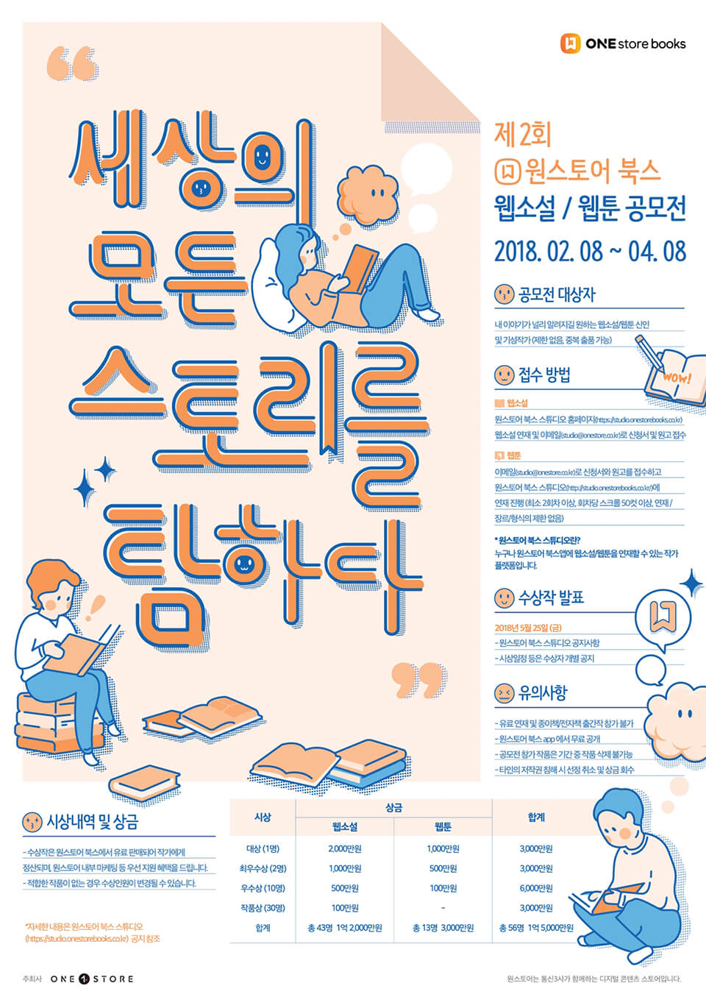

- **\- 세상의 모든 스토리를 탐하다**
- **\- 경력, 장르 제한 없이 신선한 콘텐츠 적극 발굴**
- **\- 마케팅 지원, 멘토링 프로그램 등 수상 작가를 위한 다양한 특전 마련**

원스토어 주식회사(대표 이재환)가 재능 있는 작가의 재미와 감동이 있는 참신한 스토리 콘텐츠를 발굴하기 위해 '제2회 원스토어 북스 웹소설·웹툰 공모전'을 진행한다.

원스토어의 웹소설·웹툰 오픈 플랫폼인 '원스토어 북스 스튜디오'를 통해 진행되는 이번 공모전은 '세상의 모든 스토리를 탐하다'라는 주제로 장르에 구분 없이 자신만의 스토리가 있는 사람이라면 기성 작가부터 신인까지 제한 없이 참여 가능하다.

참여 방법은 '원스토어 북스 스튜디오' 사이트(https://studio.onestorebooks.co.kr)에서 회원가입을 하고 작품 연재 및 신청서를 4월 8일까지 제출하면 된다.

원스토어는 작가, 기획자 등 전문성 있는 심사위원의 심사결과와 독자 인기 지수 등을 합산해 보다 객관적이고 공정한 심사를 거쳐 총 53명의 수상자를 5월 25일 원스토어 북스 스튜디오를 통해 발표한다.

선정된 수상자에게는 웹소설 대상 2천만원, 웹툰 대상 1천만원을 비롯해 총 1억 5천만원 규모의 상금을 지급하며 작품 홍보를 위한 다양한 마케팅을 지원한다. 수상작품은 원스토어 북스 플랫폼 내 유료 판매해 이 중 독자들의 반응이 뜨거운 작품은 전자책으로 출간한다.

특히, 공모전 우수작의 경우 검토를 통해 SK브로드밴드의 프리미엄 동영상 플랫폼 '옥수수(oksusu)'의 오리지널 콘텐츠 영상화 제작 지원 여부를 결정할 예정이다.

또한, 원스토어는 콘텐츠 업계의 선순환 생태계 구축을 목표로 웹툰 수상자에게 웹툰 제작 업체 전문가와 함께 하는 멘토링 프로그램을 제공해 신인 작가들의 참여 의지를 북돋우고, 우수한 작품 창작의 기반을 마련한다.

보다 자세한 내용은 원스토어 북스 스튜디오 웹사이트(https://studio.onestorebooks.co.kr)에서 확인할 수 있다.

원스토어 이재환 대표는 “원스토어 북스 스튜디오의 지난 1회 공모전을 통해 기존 문법과 형식에 구애 받지 않고, 자유로운 상상의 힘과 가능성을 가진 일반인 작가 발굴에 성과를 거두었다”며 “원스토어는 타 웹소설 플랫폼 대비 작가 수익 배분 비율을 높여 유능한 작가들의 활발한 참여를 유도하는 한편, 공모전 역시 지속하여 콘텐츠 업계에서 큰 권위와 신뢰를 갖출 수 있도록 노력하겠다”고 덧붙였다.

한편, 원스토어는 누구나 웹소설이나 웹툰을 올릴 수 있는 플랫폼 '원스토어 북스 스튜디오'를 통해 작가 지망생들이 손쉽게 작품을 올리고 독자들과 소통할 수 있는 기회를 제공하는 것은 물론 영화 및 드라마와 같은 다양한 포맷으로 대중에 다가설 수 있도록 지속적인 지원을 이어나갈 계획이다.
