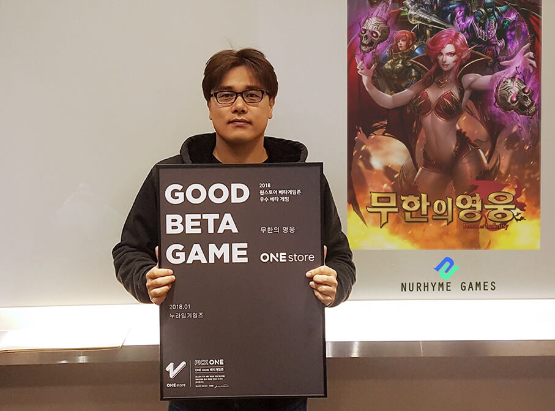

- **\- 2월 베타테스트, 12일부터 25일까지 14일간 진행 예정**
- **\- 인디게임존 2월 전시작 공개**

(주)원스토어(대표: 이재환)는 (주)누라임게임즈(대표: 이범종)의 '무한의 영웅'을 1월의 우수베타게임으로 선정했다고 밝혔다.

'무한의 영웅'은 기존의 전쟁게임과 다르게 전략과 전술이 살아 숨쉬는 방치형 실시간 전략 게임이다. 방치형으로 성장 후 개성 있는 50여개의 유닛 카드로 자신만의 부대를 구성해 실시간으로 성패를 가를 수 있고, 끝이 없는 모험모드, 도전의 탑, 투기장 등을 제공하는 것이 특징이다.

(주)누라임게임즈 대표 이범종은 “'무한의 영웅'이 원스토어 우수베타게임으로 선정되어 감사드리고 베타기간 참여해주신 유저 분들의 피드백을 잘 반영해 최고의 서비스를 제공하기 위해서 노력하겠다”고 전했다.

(주)누라임게임즈는 PC 온라인게임 및 모바일게임 개발 10년의 경력자들이 주축이 되어 '새롭고(New) 독특한(Unique) 운율(Rhyme)'을 가진 노래처럼 신선한 게임을 만들어 전세계 사람들에게 즐거움을 전하는 것이 목표인 회사이다.

2월 베타게임존은 12일(월)부터 25일(일)까지 진행될 예정이고, 유저가 베타게임존 게임을 다운받아 플레이 후 설문을 작성하면 게임당 최대 100명에게 원스토어 게임 캐쉬 1만원이 제공된다. 보다 자세한 내용은 원스토어 개발자센터(바로가기)에서 확인할 수 있다.

또한 원스토어는 2월 인디게임존 전시작 3종 '좀비 그라운드.io(아이디어박스)', '야마돌아~친구들(아이디어셀)', '던전앤메모리즈F(파이브핑거)'도 전시 중이다. 해당 게임을 전시 기간 동안 다운로드할 경우 1,000원 상당 보상이 제공된다.
