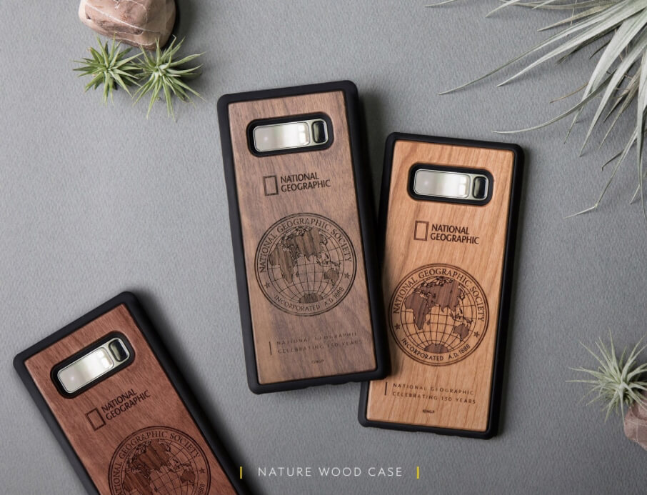

- **\- '네이처 우드', '더블 프로텍티브' 케이스 한정수량 론칭 이벤트 진행**
- **\- 통신 3사 기반 모바일 커머스로 고객 맞춤형 액세서리 추천 서비스 제공**

원스토어 주식회사(대표 이재환)가 원스토어 쇼핑 카테고리 강화를 위해 '내셔널지오그래픽 130주년 기념케이스'를 론칭하고 이를 알리는 이벤트를 진행한다.

원스토어 쇼핑은 내셔널지오그래픽 첫 입점을 기념해 '130주년 스페셜에디션'인 울트라 슬림핏, 슬림핏, 더블 프로텍티브 케이스 3종과 차량용 스마트폰 거치대 1종을 선판매하고 있으며 지난 26일부터 갤럭시용 '네이처 우드' 케이스와 '더블 프로텍티브' 케이스 구매 고객 대상 할인 쿠폰을 증정하는 론칭 기념 이벤트를 진행 중이다. 이벤트에 대한 자세한 내용은 원스토어 모바일 앱의 쇼핑 카테고리를 통해 확인할 수 있다.

한편, 원스토어는 안드로이드 운영체제 기반의 휴대폰에 선탑재된 앱의 특성 상 이용자가 휴대폰 단말기나 통신사를 변경해도 이전 사용내역을 그대로 이어 사용할 수 있다. 이에 원스토어 쇼핑 카테고리는 고객의 모바일 라이프 주기에 맞춰 신규 구매자의 경우 보호필름이나 강화유리를, 단말기 구매 후 6개월 정도 지난 경우에는 새로운 케이스를 추천하는 등 알맞은 액세서리 상품을 큐레이팅해주는 서비스를 제공 중이다.

원스토어 배성윤 매니저는 "원스토어 쇼핑 서비스는 통신 3사를 기반으로 하는 모바일 커머스로 고객의 단말 기종에 따른 제품 추천이 가능하다"며 "모바일 액세서리의 종류가 많아 탐색이나 결정에 어려움을 겪는 고객들이 많은데 원스토어 쇼핑의 추천 서비스를 통해 쉽고 편리하게 맞춤형 액세서리를 구매하길 바란다"고 전했다.
