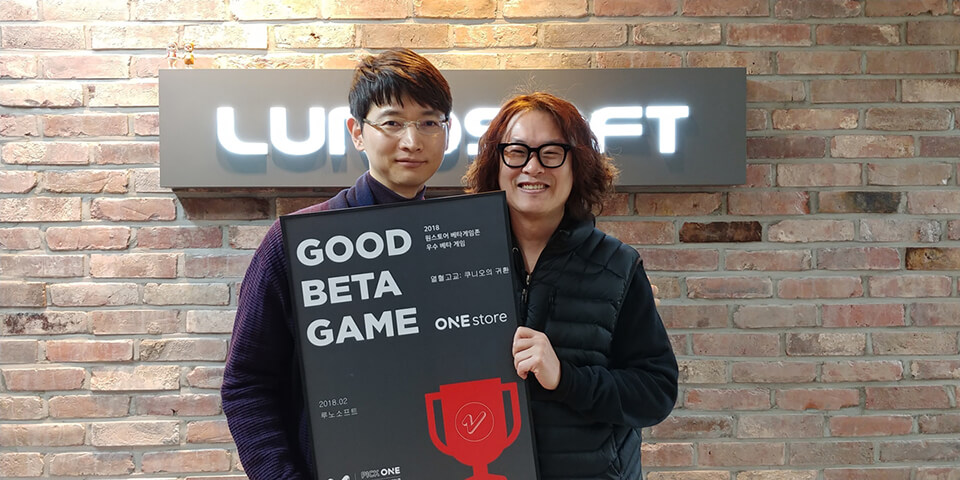

- **\- 3월 베타테스트, 12일부터 25일까지 14일간 진행 예정**
- **\- 인디게임존 3월 전시작 공개**

원스토어(주)(대표: 이재환)는 (주)루노소프트(대표: 김복남)의 '열혈고교: 쿠니오의 귀환'을 2월의 우수베타게임으로 선정했다고 밝혔다.

'열혈고교: 쿠니오의 귀환'은 콘솔 게임으로 빅히트를 기록했던 '열혈고교: 쿠니오' 시리즈의 계보를 잇는 방치형 RPG이다. 간단한 조작만으로도 손쉬운 게임 진행과 빠른 성장이 가능하고, 무한한 스테이지와 140여 종의 매력만점 캐릭터를 수집할 수 있으며, 모든 캐릭터가 6성까지 진화가 가능하다는 장점을 가지고 있다. 무엇보다 방치해두는 것만으로도 자동 게임 진행과 성장이 함께 이루어져 업무로 바쁜 직장인들도 쉽게 즐길 수 있다.

(주)루노소프트 대표 김복남은 "원스토어 베타게임존을 통해 열혈시리즈 팬들의 뜨거운 애정을 체감했고, 더불어 우수베타게임으로도 선정되어 더 큰 영광으로 생각한다"며 유저분들이 주신 의견 하나하나를 소중히 반영하고, 앞으로도 유저들과 함께 호흡하며 게임의 완성도를 더욱 높이겠다."고 전했다.

(주)루노소프트는 2006년 설립한 캐주얼 모바일 게임 전문 개발사 및 퍼블리셔로 다양한 채널과 플랫폼에 20종 이상의 게임을 서비스하고 있으며, 대표작 '디즈니 틀린그림찾기 for Kakao', '신봉선맞고'를 포함해 글로벌 누적 3000만 다운로드를 기록한 바 있다. 

'열혈고교: 쿠니오의 귀환'을 개발한 (주)웨일버드는 10년 이상의 온라인 및 모바일 개발 경력을 가진 탄탄한 개발자들이 뭉친 역량 있는 개발사이다.

원스토어 3월 베타게임존은 12일(월)부터 25일(일)까지 진행되며 유저가 베타게임존 게임을 다운받아 플레이한 후, 설문을 작성하면 게임당 최대 100명에게 원스토어 게임 캐쉬 1만원이 제공된다. 보다 자세한 내용은 원스토어 마켓 또는 원스토어 개발자센터(https://dev.onestore.co.kr)에서 확인할 수 있다.

또한 원스토어는 3월 인디게임존 전시작 3종인 머글의 '가디언아레나', 판타윙의 '킹덤디펜스:타워 전쟁', 메이플라워엔터테인먼트의 '초 대미지 프린세스'를 전시 중이다. 해당 게임을 전시 기간 동안 다운로드하면 1,000원 상당의 보상이 제공된다.
