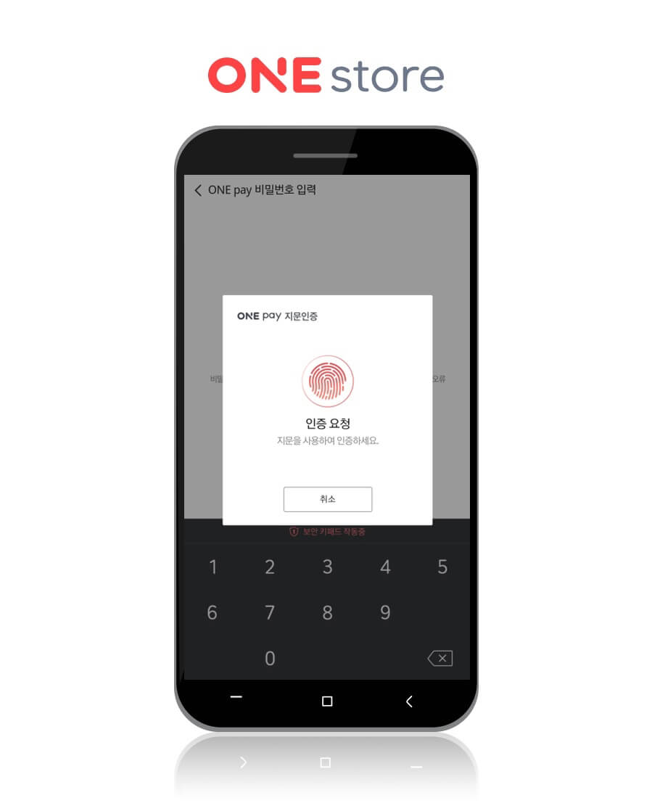

- **\- 이용자·개발자 편의성 대폭 강화하는 결제 환경 업그레이드 지원**
- **\- 3월 신규 인앱결제 개발 도구(SDK) 배포, 향후 앱·게임별 순차 적용 예정**

원스토어 주식회사(대표 이재환)가 간편결제 서비스에 지문인식 기능을 추가해 결제 편의성을 한층 개선한다.

원스토어는 전용 간편결제 서비스 '원페이(ONE pay)'에 지문인식 기능을 추가, 비밀번호 입력 없이 지문인증만으로 더욱 빠르고 편리한 결제를 제공한다. '원페이(ONE pay)'는 원스토어 회원 누구나 이용할 수 있는 신용카드 기반의 간편결제 서비스다.

또한 지난달 12일, 팝업형 결제화면을 지원하는 신규 인앱결제 개발도구(SDK, Software Development Kit)를 배포했다. 이번 버전은 진행하고 있던 게임이나 앱 화면을 벗어나지 않고, 사용 중인 콘텐츠 방향 모드에 맞춰 팝업 창으로 결제를 할 수 있어 이용자들에게 콘텐츠 사용의 연속성을 보장해 준다.

이 밖에도 신규 개발도구에는 개발자가 편리하게 개발·운영할 수 있는 다양한 기능이 제공된다. 이용자가 결제를 완료하거나 취소했을 경우 개발사 서버로 실시간 푸시를 전송하는 기능을 제공해 결제 안정성을 강화했고, 상품 지급 및 회수도 보다 손쉽게 처리가 가능해졌다. 신규 SDK 다운로드 및 자세한 내용은 원스토어 개발자센터(https://dev.onestore.co.kr)에서 확인할 수 있다.

원스토어의 이재환 대표는 "결제 외에도 사용자, 개발자의 편의성을 높일 수 있도록 사용 환경에 최적화된 기능들을 지속적으로 확대해 나갈 것"이라고 전했다.
