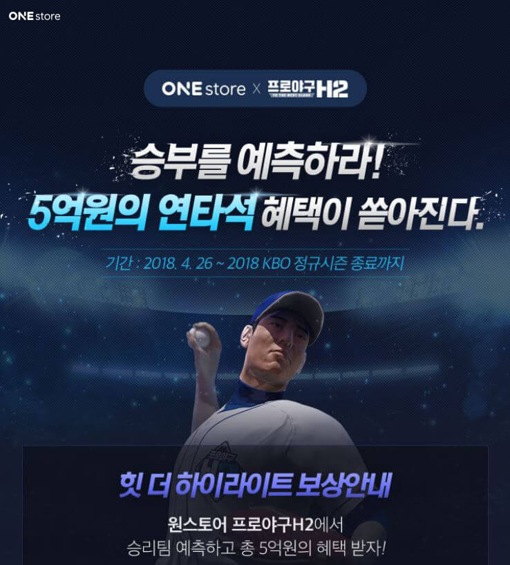

- **\- 2018 시즌 종료까지 '프로야구 H2'와 KBO 승리 예측 이벤트**
- **\- 연속 50경기 승리 예측할 경우, '1억 인생 위시팩' 경품 제공**

원스토어 주식회사(대표 이재환)가 본격적인 프로야구 시즌을 맞아 4월 26일부터 엔씨소프트의 모바일 게임 '프로야구 H2'와 함께 '힛 더 하이라이트' 제휴 이벤트를 실시한다.

'힛 더 하이라이트'는 KBO 실제 경기 결과를 예측하는 총 상금 5억 규모의 대규모 이벤트로 2018 KBO 시즌 종료 시점까지 진행된다

참가자는 '프로야구 H2' 게임 접속 후 'KBO 예측'에서 매일 승리팀을 예측할 수 있으며, 연속으로 적중한 회수에 따라 10회 달성부터 최대 50회 이상 달성까지 다양한 경품을 지급받는다.

특히, 50회 이상 달성하는 참가자에게는 '1억 인생 위시(Wish)팩'이 제공된다. '1억 인생 위시팩'은 1억원 내의 자동차, 가전, 여행 항공권 등 6개 카테고리 중 취향에 맞게 선택할 수 있는 상품으로, 50연승 예측 정답자가 다수 발생할 경우에는 인원수에 따라 동일하게 배분해 지급할 예정이다.

'프로야구 H2' 이용자라면 누구나 KBO 예측에 참가할 수 있으나 경품 수령을 위해서는 원스토어를 통해 '프로야구 H2'를 설치하고, 이벤트 리워드 신청 과정을 거쳐야 한다. 프로모션 상세내용은 해당 웹페이지(http://onesto.re/BzmFbk)에서 확인 가능하다.

원스토어 게임 사업 담당자는 "'힛 더 하이라이트'는 '프로야구 H2'의 2018년 슬로건인 '메이크 유어 하이라이트(Make Your Highlight)'의 연장선으로 이벤트 참가자들이 50연승을 정확히 예측하는 하이라이트의 주인공이 되라는 의미를 담고 있다"며, "'프로야구 H2'는 꾸준히 원스토어 마켓 상위권에 자리를 지키고 있는 인기 게임으로 앞으로도 지속적인 제휴 이벤트를 진행할 예정이니 많은 관심 부탁드린다"고 전했다.

한편, '프로야구 H2'는 엔씨소프트가 서비스하는 모바일 야구 매니지먼트 게임으로 이용자는 구단주 겸 감독으로서 구단을 성장시키고 다른 이용자와 승부를 즐길 수 있다.
