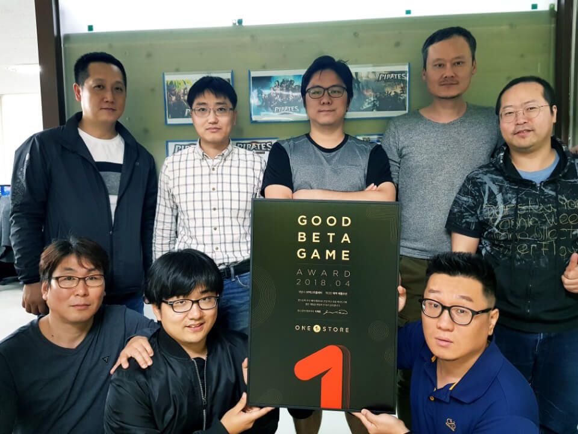

- **\- 5월 베타게임존, 11일부터 25일까지 15일간 진행 예정**
- **\- 인디게임존 5월 전시작 공개**

원스토어(주)(대표: 이재환)는 (주)넥스트플레이(대표: 조명환)의 '해적:배틀오션'을 4월의 우수베타게임으로 선정했다고 밝혔다.

해상전 기반 모바일 MMORPG인 '해적:배틀오션'은 함선을 이용한 실시간 해상전과 액션RPG 방식의 영웅 백병전 시스템을 도입해 다양한 게임 플레이는 물론, 기존 해상 전투 게임에서 느낄 수 없는 시원한 타격감을 제공한다.

(주)넥스트플레이 대표 조명환은 "'해적:배틀오션'이 원스토어 우수베타게임으로 선정되어 매우 기쁘고, 앞으로도 해상 전투의 진수를 보여드릴 수 있도록 꾸준히 업데이트를 진행해 유저분들에게 최고의 만족감을 선사할 수 있도록 노력하겠다"고 전했다.

(주)넥스트플레이는 다양한 게임 개발 노하우를 보유한 베테랑들이 모여 2017년 설립한 모바일 게임 회사로 '해적:배틀오션'을 기반으로 한 '카드오델로'도 원스토어를 통해 선보일 예정이다.

5월 베타게임존은 11일(금)부터 25일(금)까지 진행 예정이다. 유저가 베타게임존 게임을 다운받아 플레이 후, 설문을 작성하면 게임당 최대 100명에게 원스토어 게임 캐쉬 1만원이 제공된다. 보다 자세한 내용은 원스토어 개발자센터(https://dev.onestore.co.kr)에서 확인할 수 있다.

또한, 원스토어는 5월 인디게임존 전시작 3종도 전시 중이다. 5월 인디게임존 전시작은 '가즈아 히어로즈(엔큐게임즈), 방치를 잡다(하프타임스튜디오), 팜워즈(에픽피어)'이다. 해당 게임을 전시 기간 동안 다운로드하면 1,000원 상당의 보상이 제공된다.
