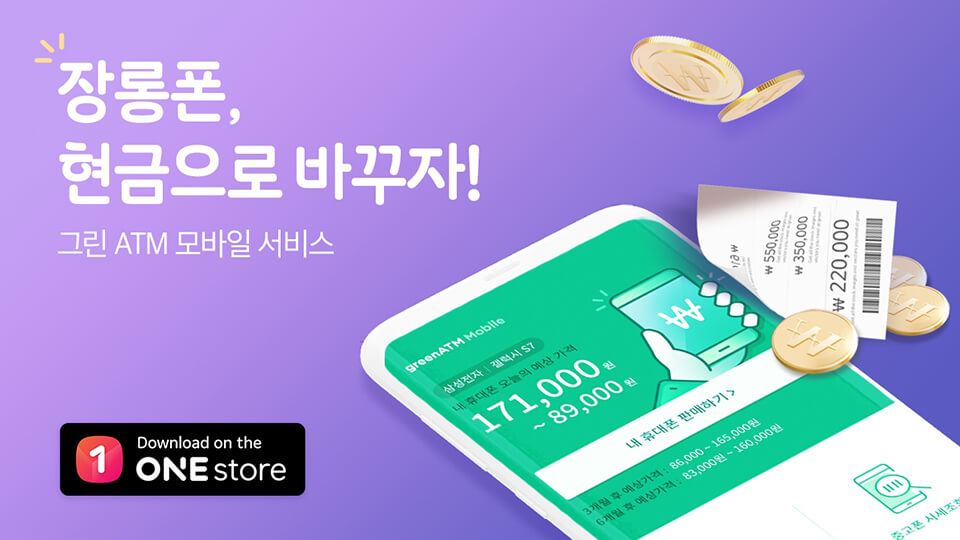

- **\- 서랍 속 잠들어있는 스마트폰, 원스토어에서 현금으로 바꿔드려요**
- **\- 버튼 하나로 5분 내 25가지 기능 점검**
- **\- 6개월 후 보상 가격 확인으로 최적의 단말기 교체 시기 제시**

원스토어 주식회사(대표 이재환)가 리싸이클 서비스 솔루션 기업 '금강시스템즈(대표이사 조성락)'와 함께 중고 스마트폰 매입 서비스 'greenATM X Onestore(이하, 그린 ATM X 원스토어)'앱을 17일 원스토어에서 단독 출시한다.

정보통신정책연구원의 조사에 의하면 한국인의 스마트폰 사용 주기는 평균 18개월로 중국 20.2개월, 미국 22.7개월, 영국 23.4개월과 비교해 짧은 편이다.

이에 한발 더 나아가 대부분의 소비자들이 교체 후 사용하던 중고 스마트폰을 어떻게 처리할지 모르거나 개인정보 유출 등의 우려로 서랍 속에 보관하다 유실되는 경우가 발생한다. 판매를 시도하는 경우에도 중고폰 가격을 확인할 수 있는 공신력 있는 채널이 없어 소비자가 제대로 된 가격을 알기 힘든 상황이다.

양사의 공동 사업으로 출시하는 '그린 ATM X 원스토어'는 금강시스템즈의 자체 개발 솔루션인 'greenATM 매입솔루션'을 적용한 국내 최초 스마트폰 매입 O2O(온·오프라인 연계) 서비스 이다.

'그린 ATM X 원스토어'앱은 간단한 조작으로 중고 스마트폰의 각종 버튼, 센서, 카메라, 액정 화면과 배터리 등의 상태를 확인한 뒤 가장 합리적인 단말기 가격을 제시한다. 고객이 제시된 가격에 만족할 경우 단말기를 택배 배송 후 송장 번호만 입력하면 고객의 계좌번호로 바로 현금을 송금해준다.

전문 감정 프로그램을 통해 중고 가격 선정에 영향을 미치는 기능 25가지를 5분 이내에 점검할 수 있으며, 스마트폰의 중고 시세 DB와 연동해 현재 보상가격은 물론 3개월, 6개월 후의 보상가격까지 실시간으로 확인할 수 있어 약정기간, 할부금 등을 고려한 가장 효율적인 단말기 교체시기를 선택할 수 있다.

또한, 도난 및 분실 여부 확인은 물론 소비자들의 개인정보 및 데이터 유출 우려를 방지하기 위한 데이터 삭제 프로그램을 탑재해 안전한 데이터 삭제를 보장한다. 특히, 이메일을 입력할 경우 데이터를 완벽하게 삭제했고, 개인정보 유출 위험이 없다는 것을 보증하는 '데이터 삭제 인증서'를 송부하여 데이터 유출에 대해 소비자를 안심시킨다.

그린 ATM앱을 개발한 금강시스템즈는 IT기기 및 휴대폰 리사이클 전문업체로서 greenATM 휴대폰 자동 매입기를 홈플러스 등 대형 유통 매장에 설치해 중고폰 매입 서비스를 해오고 있다. 지난 2016년에는 마이크로소프트에 공인 등록된 글로벌 리퍼비시 전문 업체 중 아시아태평양국가에서 가장 많은 리퍼용 정식 OS를 탑재한 회사에 수여되는 'APC 아시아 세일즈 탑 어워드'를 수상한 바 있다.

원스토어의 이재환 대표는 "'그린 ATM X 원스토어' 서비스를 통해 중고 스마트폰 시장의 안전한 거래 문화 정착과 더불어 자원 재활용 활성화에 도움이 되었으면 한다"며 "원스토어는 앞으로도 토종 앱마켓의 개방성과 유연함을 기반으로 온오프라인을 넘어 다양한 플랫폼으로 서비스를 확대해 나갈 것"이라고 밝혔다.

'그린 ATM X 원스토어'앱은 안드로이드 OS기반의 스마트폰 사용자라면 원스토어에서 무료로 다운로드 받을 수 있다.
