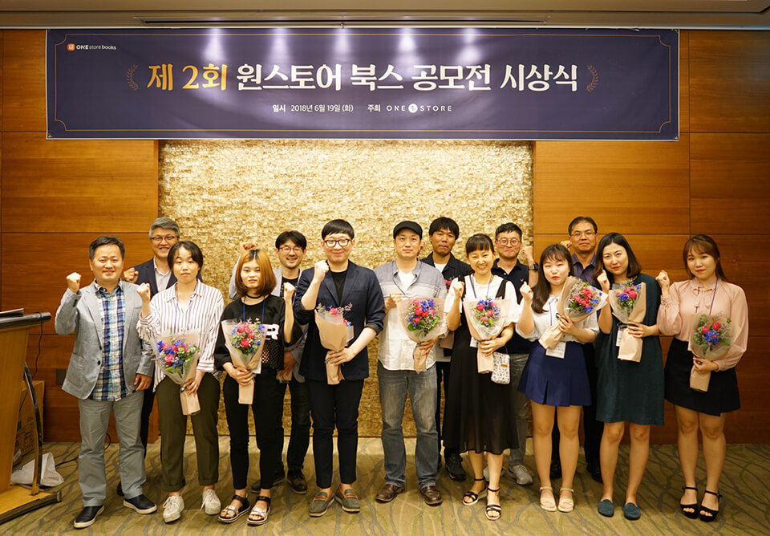

- **\- 웹소설 '옆집에 사는 악마', 웹툰 '멘탈 쓰레기' 대상 수상**
- **\- 전년 대비 출품작 2배 증가, 단기간 조회수 급성장 등 오픈 플랫폼으로서 의미 있는 성과 거두어**

원스토어 주식회사(대표 이재환)가 19일 오후 판교 메리어트 호텔에서 '제 2회 원스토어 북스 웹소설·웹툰 공모전' 시상식을 개최했다.

공모전은 '세상의 모든 스토리를 탐하다'를 주제로 원스토어의 작가 연재 오픈 플랫폼 '원스토어 북스 스튜디오'에서 지난 2월 8일부터 4월 8일까지 진행됐다. 올해 웹소설 부문에는 지난 1회 대비 2배 증가한 800편 이상의 작품이 연재되었고, 신설 부분인 웹툰 역시 100여편이 연재되며 높은 참가자 수를 기록했다.

이 중 공모전 조건에 충족되는 웹소설 360편과 웹툰 50편을 30여명의 전문 심사위원과 독자 심사위원단이 작품의 대중성, 독창성 등 8개 항목으로 평가했고, 원스토어 북스 내 조회수, 댓글 수 등 독자의 인기지수를 산출해 최종 수상작을 선정했다.

웹소설 부문에서 대상의 영광은 <내 옆에 사는 악마>(필명 아르주)에게 돌아갔으며, 최우수상에는 <요괴뎐>(필명 제이제이), <영생>(필명 현수)이 선정되었다.

대상으로 선정된 작품 <옆집에 사는 악마>는 탄탄한 스토리 라인과 인물의 행동 및 심리 묘사가 탁월해 독자가 끝까지 긴장의 끈을 놓을 수 없을 정도로 흡입력이 높은 작품이라고 호평 받았다.

웹툰 부문 대상은 개성 있는 그림체와 작화 능력, 초반부터 높은 몰입도로 독자에게 강렬한 재미를 선사할 것이라 평가 받은 <멘탈 쓰레기>(필명 포웜)에게 돌아갔다.

총 56편의 수상작 작가에게는 웹소설 부문 대상 2천만원, 웹툰 부문 대상 1천만원을 포함해 총 1억 5천만원의 상금이 지급되며 수상작은 원스토어 북스에 독점 연재된다. 또한, '원스토어 북스 스튜디오' 플랫폼 내 유료 판매는 물론, 원스토어의 전폭적인 마케팅 활동이 지원되어 웹소설의 웹툰화, 웹드라마 작업 등 판권을 통한 파생상품 제작 및 외부 유통까지 2차 퍼블리싱에 따르는 판매수익을 기대할 수 있다.

원스토어 북스는 제작 파트너사들과 2회 공모전 수상작의 성공적인 웹툰화와 영상화를 적극적으로 추진할 계획으로 지난 1회 공모전 수상작 중에서도 현재 8개의 웹소설이 웹툰화 작업을 통해 이르면 올해 9월부터 원스토어 북스에서 웹툰으로 독점 공개될 예정이다.

원스토어 이재환 대표는 "수상한 작가를 비롯해 모든 참가자 분들께 진심으로 감사의 말씀을 드리며, 이번 2회 공모전은 1회 대비 작가들도 2배 이상 참가했고, 독자들의 조회 건수도 최근 5개월 동안 6배가 넘게 증가해 양적으로나 질적으로 모두 성장하는 좋은 성과를 거두었다"며 "원스토여 북스 스튜디오를 통해 작가들이 활발하게 참여하고 이들이 가진 다양한 이야기의 감동이 많은 독자에게 사랑 받는 선순환 서비스를 제공하고자 최선을 다하고 있다"고 전했다. 

이번 공모전 수상작은 '원스토어 북스' 앱의 웹소설, 웹툰 카테고리에서 자세한 내용을 확인할 수 있다.

한편, 지난 해 6월에 오픈한 '원스토어 북스 스튜디오'는 최근 영화 및 드라마 등의 원작으로 각광받는 웹소설, 웹툰 전용 플랫폼으로, 작년 1회 웹소설 공모전을 성황리에 개최해 60여명의 작가를 발굴한 바 있다.
