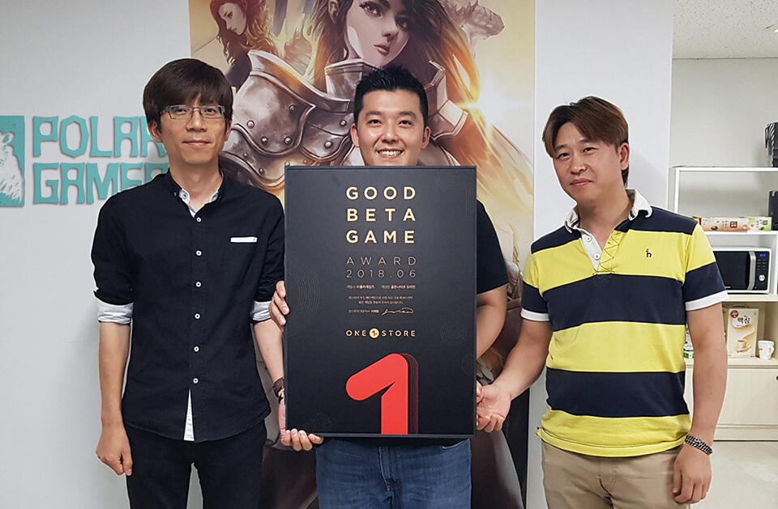

- **\- 우수베타게임 대상 네이버 클라우드 인프라 비용 무상 지원**
- **\- 7월 베타게임존, 12일부터 25일까지 14일간 진행 예정**
- **\- 인디게임존 7월 전시작 공개**

(주)원스토어(대표: 이재환)는 (주)폴라게임즈(대표: 조영종)의 '골든나이츠 오리진'을 6월의 우수베타게임으로 선정하고, 이달부터 우수베타게임에게 네이버 클라우드 인프라 비용을 무상 지원한다고 밝혔다.

이달부터 우수베타게임은 게임 출시 전 네이버 클라우드 테스트 인프라 비용, 출시 당월과 익월에 발생된 네이버 클라우드 인프라 비용을 무상으로 지원 받을 수 있다. 보다 자세한 내용은 원스토어 개발자센터에서 확인할 수 있다.

이달 선정된 '골든나이츠 오리진'은 과금 유무를 떠나 RPG 게임의 본질인 성장, 장비 획득, 전략 3가지 요소의 재미를 느낄 수 있도록 한 것이 특징이다.

(주)폴라게임즈 조영종 대표는 "정식 출시를 앞두고 진행한 베타테스트에서 특히 장비 초월 시 파괴되지 않는 부분, 영웅 소환 시 획득 포인트로 높은 등급의 캐릭터를 얻을 수 있는 부분, 그리고 안정적인 서비스 환경에 높은 점수를 주신 것 같다"며 "게임 내 이벤트와 카페 이벤트 등으로 과금 여부를 떠나 재미에 초점을 맞춰 안정적으로 서비스하겠다"고 전했다.

(주)폴라게임즈는 10년 이상의 게임 경력 개발자들이 모여 2016년 설립한 RPG 전문 개발사로 '17년 우수베타게임' 수상 및 '제2회 원스타 발굴 프로젝트' 국내외 부문 1위에 오른 '어둠의 군주'를 서비스하며 뛰어난 기술력과 노하우를 인정받은 바 있다.

7월 베타게임존은 12일(목)부터 25일(금)까지 14일 동안 진행되고, 유저가 베타게임존 게임을 다운받아 플레이한 뒤, 설문을 작성하면 게임당 최대 100명에게 원스토어 게임 캐쉬 1만원이 제공된다.

한편, 원스토어는 7월 인디게임존 전시작 3종도 전시 중이다. 7월 인디게임존 전시작은 '래빗인더문(데브플로어)', '던전 크로니클(벙커림스튜디오)', '택틱스로드(수육스튜디오)'이다. 해당 게임을 전시 기간 동안 다운로드 시 1,000원 상당 보상이 제공된다.
