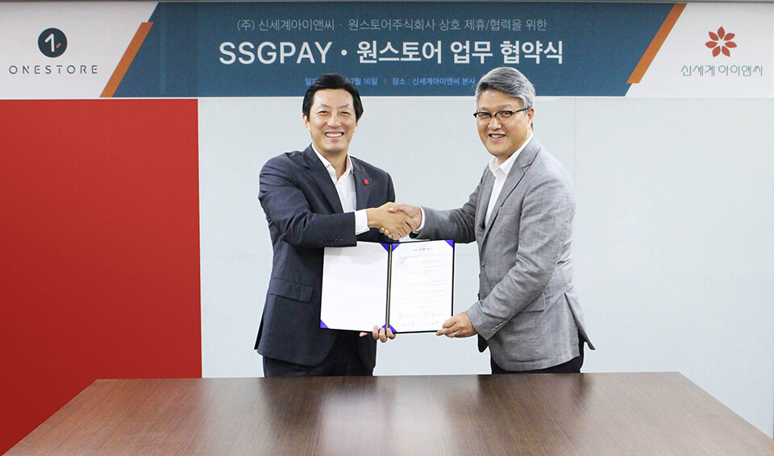

- **\- 원스토어 기프트카드, 신세계 유통 채널에서 판매 시작**
- **\- 열린 결제 생태계를 조성하고 동반 성장을 위해 함께 힘쓰기로 다짐**

'원스토어' 주식회사(대표 이재환)와 '신세계아이앤씨'(대표 김장욱)가 지난 16일 서울 신세계아이앤씨 본사에서 소비자에게 보다 다양한 결제 수단을 제공하기 위한 'SSG페이-원스토어 업무 협약식'을 체결했다.

원스토어와 신세계아이앤씨와의 이번 협약으로 원스토어의 '선불형 기프트 카드(POSA)'를 이마트, 이마트24, 일렉트로마트에서 판매하게 된다. 또한 핀번호만으로 결제가 가능한 원스토어의 '디지털 기프트 카드'를 'SSG페이'앱에서 구입할 수 있게 된다 

또한, 원스토어는 신세계아이앤씨의 'SSG페이'를 원스토어 내 외부 결제 수단으로 도입할 예정이다. 이를 통해 원스토어의 다양한 앱과 게임, e-book 등을 'SSG페이'를 통해 결제할 수 있어 이용자들에게 결제의 다양성과 편의성을 강화할 것으로 기대된다.

원스토어는 이번 기프트 카드 론칭을 기념해 오는 26일부터 8월 25일까지 이마트, 이마트24, 일렉트로마트에서 원스토어 선불형 기프트 카드를 구매하는 소비자들에게 10% 캐시업 혜택과 함께 구매금액에 따른 '삼국지M'게임 아이템 쿠폰을 제공한다. 

이번 협약에 따라 양사는 '원스토어'의 종합 모바일 콘텐츠 유통 플랫폼 자원과 '신세계아이앤씨'의 간편결제 서비스 'SSG페이'를 활용해 열린 결제 생태계를 조성하고 동반 성장을 위해 함께 힘쓰기로 했다.

'원스토어' 이재환 대표는 "점차 기프트 카드 구매처를 확대해 나감으로써 이용자들이 일상에서 더욱 편리한 모바일 라이프를 즐길 수 있을 것이라 기대된다"고 밝히며, "앞으로도 외부 결제 업체와의 제휴를 지속적으로 모색해 완전한 개방형 앱 마켓으로 거듭날 수 있도록 노력을 이어나갈 것"이라고 전했다.
