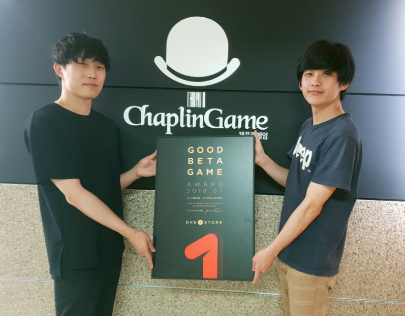

- **\- 우수베타게임 대상 네이버 클라우드 혹은 SK C&C 클라우드 제트 인프라 비용 무상 지원 혜택**
- **\- 8월 베타게임존 13일부터 25일까지 진행, 인디게임존 8월 전시작 공개**

(주)원스토어(대표: 이재환)는 (주)채플린게임(대표: 오영일)의 '삼국지K : 킹메이커(이하 삼국지 K)'를 7월의 우수베타게임으로 선정하고, 이달부터 우수베타게임에게 SK C&C의 '클라우드 제트' 인프라 비용을 무상 지원한다고 밝혔다.

이달부터 원스토어 우수베타게임은 SK C&C의 '클라우드 제트'를 사용하는 경우, 게임 출시 전 테스트 인프라 비용, 출시 당월과 익월까지 발생한 '클라우드 제트' 인프라 비용을 무상으로 지원 받을 수 있다. 지난 달 네이버 클라우드 인프라 비용 무상 지원에 이은 추가 혜택 소식으로, 보다 자세한 내용은 원스토어 개발자센터에서 확인할 수 있다.

이달 선정된 '삼국지K'는 MMOSLG 게임으로, 4개 국가 간의 치열한 영토전쟁을 소재로 하며 SLG와 수집형 RPG의 장점을 잘 섞어놓은 것이 특징이다.

(주)채플린게임 오영일 대표는 "'삼국지K'가 원스토어 우수베타게임으로 선정돼 감사드리고, 앞으로도 '삼국지K'만의 고유한 국가전 시스템을 발전시켜 나갈 예정이니 많은 기대 부탁 드린다"고 전했다.

(주)채플린게임은 2016년 12월에 설립 이후 미소녀 수집형 RPG '크리티걸', 팀플레이 야구게임 '우리동네 야구단' 등 여러 흥행작을 출시한 모바일 게임 개발사로 그 중 무협 MMORPG '군림'은 지난 2017년 12월 원스토어 우수베타게임으로 선정된 바 있다.

8월 베타게임존은 13일(월)부터 25일(토)까지 13일 동안 진행되고, 유저가 베타게임존 게임을 다운받아 플레이한 뒤, 설문을 작성하면 게임당 최대 100명에게 원스토어 게임 캐쉬 1만원이 제공된다.

한편, 원스토어는 8월 인디게임존 전시작 3종도 전시 중이다. 8월 인디게임존 전시작은 '버스터 소울(에스민 인베스트먼트)', '더 스컬(피플러그)', '브레이드 퀘스트(퀘스트 게임즈)'이다. 해당 게임을 전시 기간 동안 다운로드 시 2,000원 상당 보상이 제공된다
