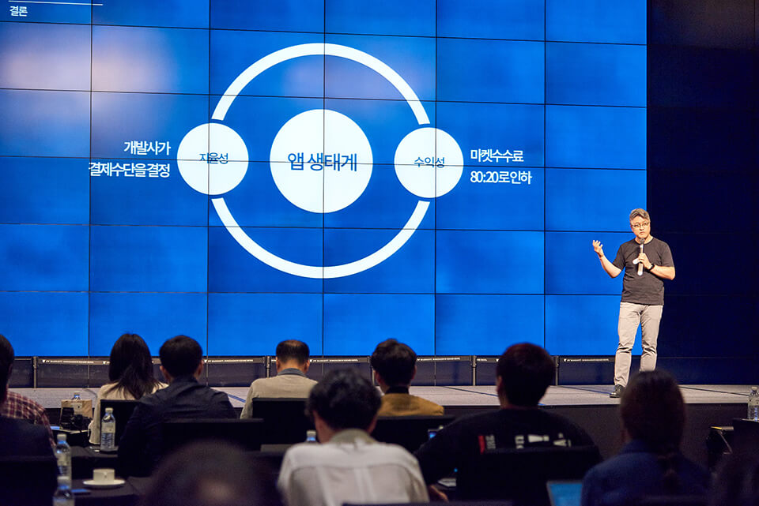

- **\- 신규정책 발표 뒤 등록상품수 30%, 거래액 15% 증가 등 실적 호조**
- **\- 원스토어 출시에 소극적이었던 게임사들의 입장 변화 감지**
- **\- 9월부터 삼성전자 갤럭시앱스 게임 한 달간 등록 뒤 10월 오픈**

원스토어가 올해 7월 수수료 최대 25% 인하 등 새로운 앱 유통 정책 발표에 대한 2개월간의 중간 성과를 공개했다. 원스토어 주식회사(대표: 이재환)는 정책변경 이전과 비교해 신규등록 앱/게임 상품 수가 약 30%, 전체 거래액은 15% 증가했다고 밝혔다.

원스토어의 정책 발표 후 기존에는 구글과 애플의 앱마켓에 집중했던 중대형 게임사들이 긍정적 반응을 보이며 변화에 적극적으로 동참하고 있다. 최근 2년간 원스토어와 거래가 드물었던 국내 대형 게임사 넥슨의 경우 '피파온라인4'에 이어 '카이저'를 8월 말 출시하며 원스토어의 새로운 정책에 힘을 실었다.

원스토어 관계자는 "지금까지 거래 관계가 없었던 국내 상장 게임사 한 곳과도 신작 출시를 논의 중"이라며, "기존에는 구글 및 애플 앱마켓에 선출시 후 원스토어에 뒤이은 출시를 하던 대형 게임사들이 이제는 동시 출시로 정책을 바꾸는 사례들이 계속 나오고 있다"고 설명했다.

정책 발표 후 약 2달 동안 원스토어에서 높은 매출을 올린 상품은 '삼국지M', '피파온라인4', '신삼국지 모바일', '열혈강호 for Kakao', '프로야구 H2' 순이다. 특히, 7월 이후 출시된 '삼국지M'과 '피파온라인4'가 실적을 견인한 것으로 나타났다.

최근 2개월간 원스토어의 상위권을 차지했던 대형 게임앱의 전체 매출을 봤을 때 30%에서 최대 60%까지 원스토어에서 발생한 것으로 집계됐다. 이는 구글 및 애플 앱마켓과 원스토어의 수수료 차이(최대 25%)를 감안하면 게임사가 원스토어에 게임을 출시할 경우 최대 15%까지 수익을 추가 창출할 수 있다는 의미로 해석된다.

대형 게임의 입점을 위해서는 '이용자 수가 작다'는 업계의 우려를 해소하는 것이 중요한데 원스토어의 앱/게임 유료구매자는 2개월 연속으로 9%씩 늘어나고 있어, 향후 전망이 주목된다. 원스토어는 통신 3사로 확대한 통신사 멤버십 10% 할인 프로그램이 이용자 증가에 중요한 역할을 한 것으로 판단한다. 8월까지의 멤버십 할인결제 경험자는 25만 명을 기록했고, 연말까지는 40만 명 수준에 도달할 예정이다.

또한, 원스토어가 글로벌 판로 확보를 위해 야심차게 발표했던 삼성전자 갤럭시앱스와의 제휴도 지난 3일부터 시장에 선을 보였다. 게임 개발자들은 원스토어 개발자센터 홈페이지에서 몇 번의 클릭만으로 원스토어 등록 게임을 갤럭시앱스에 등록할 수 있다. 원스토어와 삼성전자는 9월 한 달간의 상품등록기간을 거쳐 10월 초부터 게임 동시 판매를 시작할 계획이다.

원스토어 이재환 대표는 "수수료인하, 글로벌 판로 확보 등 신규 정책을 발표하면서 시장에 약속드렸던 프로그램들이 하나씩 선을 보이고 있다"며 "8월부터 자체결제 기반 상품들도 등록되기 시작된 만큼, 앱마켓 결제를 강제하지 않는 개방형 협력모델도 조만간 본격화될 예정"이라고 밝혔다.
