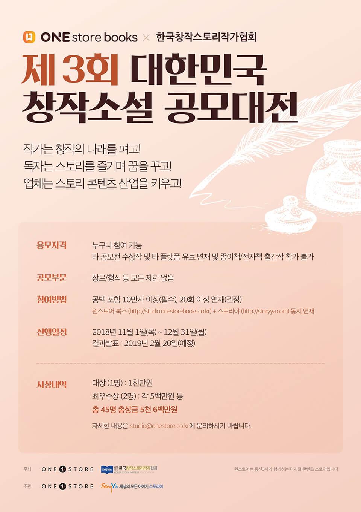

- **\- 상상의 날개를 펴라!**
- **\- 참신한 소설 작품과 작가를 발굴하고자 한국창작스토리작가협회와 공동 주최**
- **\- 총 45개 수상작 선정해 상금 및 다양한 마케팅 지원 예정**

원스토어 주식회사(대표 이재환)가 한국창작스토리작가협회(회장 성인규)와 함께 재미와 감동이 있는 소설 작품과 참신함으로 무장한 작가를 발굴하고자 '제3회 대한민국 창작소설 공모대전'을 오는 11월 1일(목)부터 개최한다.

3회째 공모전을 개최하는 원스토어 북스는 올해 처음으로 '한국창작스토리작가협회'와 공동 주최해 웹소설 생태계 개선에 적극적으로 나선다. 공모전 주제는 '상상의 날개를 펴라'로 장르에 구분 없이 자신만의 이야기를 펼치고 싶은 사람이라면 기성 작가부터 신인까지 누구나 참여 할 수 있다.

참여 방법은 '원스토어 북스 스튜디오' 사이트(https://studio.onestorebooks.co.kr)와 웹소설 플랫폼 '스토리야' 사이트(http://www.storyya.com)에서 회원 가입 후, 12월 31일까지 작품을 연재하면 된다.

특히, 이번 공모전에 출품하는 작품은 '원스토어 북스 스튜디오'와 '스토리야'에서 동시 연재되어 각 플랫폼에서 활동하고 있는 작가들이 서로의 특성과 장점을 공유하고, 상호 교류할 수 있는 좋은 기회가 될 것으로 예상된다.

원스토어는 작가 및 퍼블리싱 업체 등 업계 전문가와 '원스토어 북스'와 '스토리야' 소속 심사위원을 초빙해 작품성, 대중성, 2차 콘텐츠 확장 가능성 등을 종합적으로 검토, 총 45명의 수상자를 오는 2019년 2월 20일 발표할 예정이다.

대상 1천만원의 상금을 비롯해 모든 수상 작가에게는 홍보를 위한 플랫폼 내 다양한 마케팅 혜택이 지원된다. 또한 아쉽게 수상을 하지 못했으나 독자들에게 반응이 좋은 작품 중 검토를 거쳐 전자책 및 종이책으로 출간하고, 별도의 인세를 지급할 예정이다.

공모전 내용은 '원스토어 북스 스튜디오' 사이트(https://studio.onestorebooks.co.kr)와 '스토리야' 사이트(http://storyya.com)에서 보다 자세히 확인할 수 있다.

원스토어 이재환 대표는 "지난 공모전의 웹소설 수상작을 실제 웹툰으로 제작해 '원스토어 북스' 외에 다른 플랫폼을 통해 연재하는 등 작가와 작품 성장에 있어 좋은 결실을 맺고 있다"며 "앞으로도 웹툰을 넘어 웹드라마, 영화 등 2차 콘텐츠 제작도 적극적으로 검토해 훌륭한 이야기가 갖는 무궁무진한 가능성의 힘을 다양한 포맷으로 확산시켜 보여줄 계획"이라고 밝혔다.

한편, 원스토어는 누구나 웹소설이나 웹툰을 올릴 수 있는 플랫폼 '원스토어 북스 스튜디오'를 오픈한 이후 웹소설·웹툰 공모전을 지속적으로 진행하고 있다. 현재 총 2,300명의 작가가 원스토어 북스에서 활발하게 활동하고 있으며, 전자책 발간 및 유통, 웹소설의 웹툰화 등 다양한 포맷을 통해 독자들에게 다가설 수 있도록 지원을 이어가고 있다.
