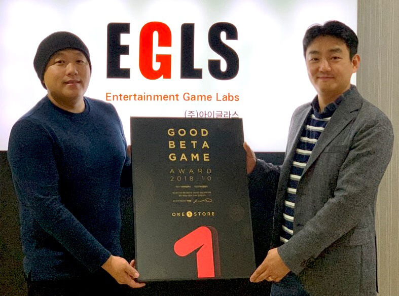

- **\- 우수베타게임은 네이버, SK C&C 클라우드 인프라 비용 무상 지원**
- **\- 원스토어 베타게임존을 통해 '카이저' 공성전 업데이트 독점 제공**

(주)원스토어(대표: 이재환)는 (주)아이글라스(대표: 유한옥)의 '초시공전기'를 10월의 우수베타게임으로 선정했다고 밝혔다.

'초시공전기'는 개성 넘치는 60여종의 캐릭터들을 수집하고 육성하는 수집형 RPG로 마치 일본 애니메이션을 보는 듯한 그래픽을 자랑하는 것이 특징이다. 호쾌한 액션, 캐릭터 간의 상성, 진영 배치를 통한 전략성을 잘 살렸다는 평을 받고 있다.

(주)아이글라스 유한옥 대표는 "'초시공전기'가 원스토어 우수베타게임으로 선정돼 감사 드리며, 베타게임존을 통해 게임 이용자들에게 유의미한 피드백을 받는 좋은 기회가 됐다"며 "이용자들의 소중한 의견을 반영해 눈높이에 맞춘 게임을 출시할 예정이니 많은 관심 부탁드린다"고 전했다.

2014년 설립한 (주)아이글라스는 '암드히어로즈', '더만남MMO', '구름과바람', '옷의나라' 등 다양한 장르의 모바일 게임을 서비스하는 베테랑 개발사이다.

선정된 우수베타게임은 네이버 클라우드 혹은 SK C&C의 클라우드 제트를 사용할 경우 게임 출시 전, 출시 당월과 익월까지 발생한 클라우드 인프라 비용을 무상으로 지원 받을 수 있다. 보다 자세한 내용은 원스토어 개발자센터에서 확인 가능하다.

원스토어는 12일(월)부터 25일(일)까지 11월 베타게임존을 진행한다. 베타게임존 게임을 다운받아 플레이하고, 설문을 작성한 유저 중 게임 당 최대 100명에게 원스토어 게임 캐쉬 1만원을 제공한다.

특히, 이번달 원스토어 베타게임존에서는 모바일 MMORPG '카이저'의 공성전 업데이트를 독점으로 선보인다. '카이저' 베타 버전을 다운로드하는 이용자에게는 정식 버전에서 사용 가능한 쿠폰을 제공할 예정이다.

또한, 11월 인디게임존 전시작인 '아재그림퀴즈(순순디자인)', '파이널워페어(앰엔앰소프트)', '너의동물은(로우핸드)'을 현재 전시 중이다. 해당 게임을 전시 기간 동안 다운로드 시 2,000원 상당 보상이 제공된다.
