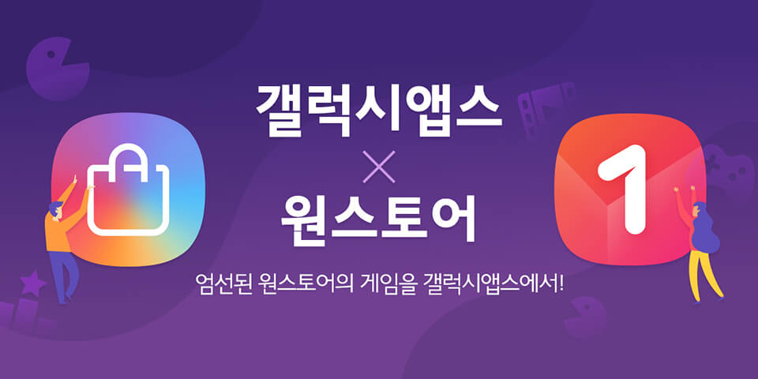

- **\- 올 10월 국내 서비스 오픈 이후 100개 이상 게임사 참여**
- **\- '지스타 2018' 기간 중 동시 판매 게임 구매자 및 게임사 대상 이벤트 실시**

삼성전자의 모바일 앱마켓 '갤럭시앱스'가 국내 대표 앱마켓 '원스토어'(대표 이재환)와의 전략적 게임 제휴를 해외 시장까지 확대한다.

삼성전자와 원스토어는 지난 7월 양 사의 역량을 합쳐 글로벌 앱마켓과 경쟁 가능한 시장을 함께 구축해 나가고자 게임 제휴 판매 협력 계약을 체결했다. 게임사가 원스토어에만 게임을 등록해도 시스템 연동을 통해 양 사 마켓에서 모두 판매할 수 있다는 내용이다.

지난 10월 국내 서비스를 론칭한 이후 현재까지 넥슨 코리아, NHN 엔터테인먼트 등 100여 개 이상의 게임사가 참여하여, 130개 이상의 타이틀이 두 마켓에서 동시에 서비스되고 있다.

삼성전자와 원스토어는 제휴 협력 활성화를 위해 부산 벡스코에서 열리는 국제 게임 전시회 '지스타 2018' 기간 동안 각각 소비자와 공급자 대상 이벤트를 진행한다. 삼성전자는 16일(금)부터 한 달간 갤럭시 앱스에서 원스토어 동시 판매 게임을 설치한 고객을 대상으로 경품 이벤트를 실시한다. 참여 고객에게는 추첨을 통해 갤럭시 노트9 등 최신 IT 기기를 포함한 다양한 선물이 지급될 예정이다.

또한, 원스토어는 16일(금)에 부산 해운대에 위치한 '더베이 101'에서 게임업계 종사자들을 초청하여 네트워킹 파티를 개최한다. 올 7월에 발표한 수수료 인하 및 삼성전자 갤럭시 앱스와의 제휴 등 신규 정책의 사업적 성과를 공유하고, 게임업계와의 협력 관계를 더 단단하게 하기 위함이다.

원스토어 관계자는 "해외 시장 확대를 포함해 다양한 영역에서 삼성전자와 원스토어의 제휴 성과를 보여드리겠다"고 전했다.
