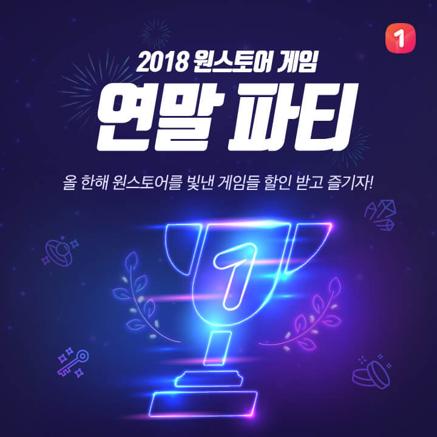

- **\- 2018년 굿 파트너 게임사 10곳과 라이징 스타 게임사 5곳에 감사패 수여**
- **\- 19일부터 해당 게임사 이용자 대상 할인 쿠폰 제공 프로모션 진행**

원스토어 주식회사(대표 이재환)가 연말을 맞아 2018년 올 한 해를 빛낸 굿 파트너(GOOD PARTNER) 게임사와 라이징 스타(RISING STAR) 게임사에게 감사패를 전달하고, 해당 게임사의 게임을 즐기는 고객들에게 할인 쿠폰을 증정한다.

원스토어는 2018년 굿 파트너 게임사와 라이징 스타 게임사를 선정하여 게임 산업의 동반자로서 감사의 마음을 전달하기 위해 감사패를 수여한다. 감사패를 받는 기업은 굿 파트너로 선정된 '이펀컴퍼니리미티드', '유엘유게임즈', '(주)넥슨코리아', '팡스카이', 'BBGame', '(주)와이제이엠게임즈', 'EYOU GAME', '37GAMES', '(주)게임펍', 'SKYLINE GAMES' 등 10개 게임사와 라이징 스타로 선정된 'Horgos Rainbow Technology Co., Ltd', 'Jun Hai Network Technology Ltd.', 'YOOZOO GAMES', '위메이드서비스', '(주)노블게임즈' 등 5개 게임사이다.

또한, 19일부터 23일까지 5일간 해당 게임사의 인기 게임을 신규 다운로드하거나 인앱(모바일 앱 내 결제) 유료 상품을 구매하는 이용자들에게 할인 쿠폰을 증정하는 프로모션 '2018 원스토어 게임 연말 파티'를 진행한다.

'삼국지M', '글로리', 'FIFA ONLINE 4 M by EA SPORTS™', '군도' 등 15개의 게임 이용자에게 20%의 할인 쿠폰을 제공하며, 게임 별 1인당 최대 3회까지 참여 기회를 열어 두어 게임을 사랑하는 이용자들이 더 큰 할인 혜택을 누리도록 할 예정이다.

원스토어 이재환 대표는 "2018년을 마무리하며 게임산업 활성화를 위해 열심히 노력한 게임사와 게임 이용자들을 위해 이번 감사패 증정과 할인 프로모션을 진행하게 되었다"며 "앞으로도 원스토어는 게임사와 동반 성장을 꾀하고 이용자들에게 더 다양한 혜택을 제공하기 위해 힘쓸 예정"이라고 전했다.
