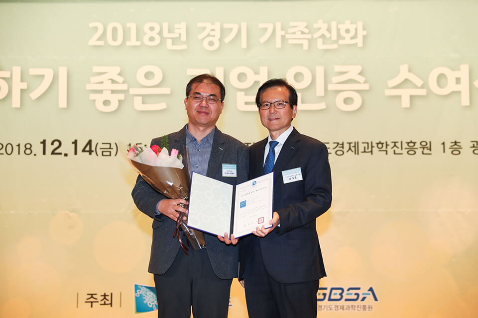

- **\- 가족친화경영 실적, 기업 안정성, 구성원 인터뷰 등 엄격한 심사 거쳐 선정**
- **\- 13일 '사랑의 꾸러미 나눔' 등 지역 가족과의 상생에도 매진**

원스토어 주식회사(대표 이재환)가 2018년 '경기가족친화 일하기 좋은 기업(GGWP)'으로 선정되어 지난 12월 14일 오후 경기도 경제과학진흥원 광교홀에서 개최된 인증식에서 공식 인증서를 수여받았다.

'경기가족친화 일하기 좋은 기업' 인증은 일·가정 양립을 적극 지원하는 모범적인 도내 기업을 발굴, 육성하기 위해 지난 2010년부터 매년 운영되고 있다. 가족친화경영 추진사례, 기업 안정성 및 대외 신인도, 고용 안정성 등을 중점 심사하며, 특히 가족친화제도 운영 실적과 재직 구성원들의 심층 인터뷰에 이르는 까다로운 검증을 거쳐 선정된다.

원스토어는 고유의 기업문화를 바탕으로 회사 구성원의 업무-가정 생활 조화를 위해 지속적으로 노력하고 있다. 이미 2016년부터 구성원의 자발적 참여를 통한 자율 출퇴근제가 정착되었으며, 사내 체육시설 운영, 의료비 지원 등의 제도 또한 큰 호응을 받고 있다. 특히, 출산과 육아를 지원하는 세심한 맞춤형 지원제도는 육아를 회사업무와 병행하는데 큰 역할을 하고 있다.

이 밖에도 원스토어는 지역 사회 구성원으로서 이웃 가정을 위한 활동에도 매진하고 있다. 지난 13일에는 성남시 자원봉사 센터와 연계하여 지역 내 독거노인 및 취약계층을 위한 '사랑의 꾸러미 나눔' 활동을 펼쳤다. 이날 행사에는 이재환 대표를 비롯한 100여명의 구성원이 참가하였으며, 꾸러미 구성에서 포장, 배달까지 모두 함께하며 나눔의 의미를 더했다.

원스토어 이재환 대표는 "기업은 많은 이들이 함께 하는 사회 공동체이면서 우리 지역사회에 속한 하나의 구성원이다. 안으로는 행복하게 일할 수 있는 회사를 만들고, 밖으로는 도움이 필요한 이웃을 지원하며 더 많은 사회적 가치를 창출해 나가겠다" 고 인증 소감을 밝혔다.
