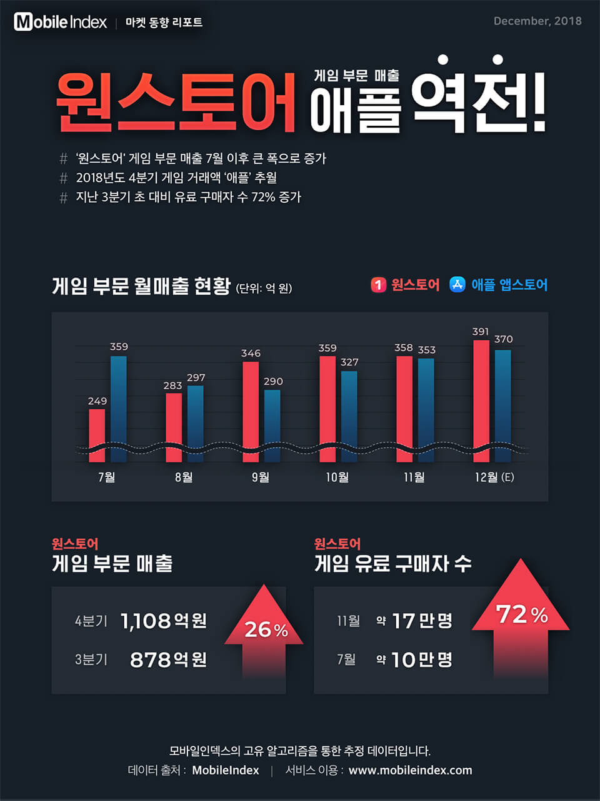

아이지에이웍스는 모바일 앱 마켓 분석 사이트 '모바일인덱스' 통계를 바탕으로 원스토어의 국내 게임 매출 부문이 애플 앱스토어를 역전했다고 27일 밝혔다.

모바일인덱스에 따르면 원스토어의 월별 게임 매출은 지난 9월부터 애플 앱스토어의 게임 매출을 넘어섰으며 이후 12월(예측치)까지 우세를 지속했다.

이 같은 성과는 원스토어에 입점한 게임 수 증가와 함께 과금 유저 규모까지 함께 늘어났기 때문으로 풀이된다. 앞서 도입한 마켓 수수료 인하 등 업체들을 겨냥한 상생 정책이 통했다는 것이다.

이전까지 애플 앱스토어는 구글 플레이와 함께 양대 마켓으로 꼽혀왔으며, 원스토어의 영향력은 미미하다는 시각이 지배적이었다. 그러나 원스토어가 지난 7월 기존 30%의 마켓 수수료를 기본 20%로 10%포인트 줄이는 등 수익분배 정책 쇄신에 나섬에 따라 판도가 뒤집히게 됐다는 것이다.

아이지에이웍스측은 "원스토어 게임부문 매출은 7월 이후 큰 폭으로 증가해 2018년도 4분기 게임 거래액이 애플을 추월했다"며 "지난 3분기 초 대비 게임 매출은 26%, 게임유료구매자수도 72% 늘었다"라고 설명했다.

모바일인덱스 추정 원스토어의 4분기 게임 부문 매출은 1108억원이었으며 월별로는 7얼 249억원, 8월 283억원, 9월 346억원, 10월 359억원, 11월 358억원이었다. 12월의 경우 391억원의 매출 달성이 예측됐다.
