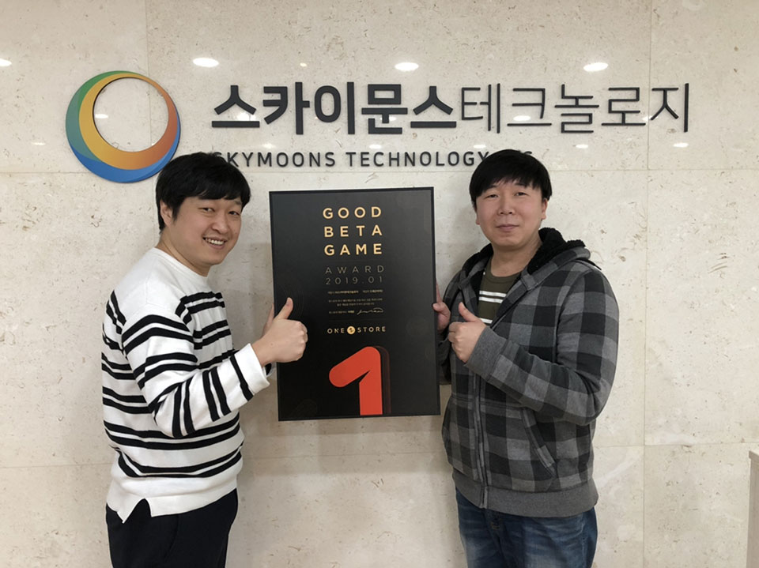

- **\- 오는 25일까지 10일간 1월 베타게임존 진행, 1월 인디게임존 전시작 공개**
- **\- 우수베타게임은 네이버, SK C&C 클라우드 인프라 비용 무상 지원**

(주)원스토어(대표: 이재환)는 (주)스카이문스테크놀로지(대표: 한명동)의 '드래곤라자2'를 12월의 우수 베타게임으로 선정했다고 밝혔다.

'드래곤라자2'는 이영도 작가의 유명 판타지 소설 '드래곤라자'의 후속작인 '퓨처워커'를 기반으로 하는 MMORPG 게임이다. 짜임새 있는 스토리와 화려한 그래픽, 타격감을 강조한 논타겟팅 전투 방식, 정교하게 설계된 성장 시스템 등이 강점이다. 특히 이번 베타게임존에서 드래곤을 활용하는 차별화된 전투를 선보이며 큰 호평을 받았다.

(주)스카이문스테크놀로지 한명동 대표는 “원스토어 베타게임존을 통해 '드래곤라자2'의 게임성 전반과 핵심 콘텐츠에 대한 검증을 마치고 유의미한 피드백을 받을 수 있었다”며 “보내주신 의견과 베타게임존 데이터 분석 결과를 바탕으로 완성도를 더욱 높인 정식 서비스로 유저분들을 찾아뵐 것”이라고 전했다.

(주)스카이문스테크놀로지는 '드래곤라자2'를 필두로 자체 게임 개발 및 글로벌 퍼블리싱을 준비하고 있다. 특히 '드래곤라자2'를 개발한 자회사 스카이문스EI게임즈는 PC 온라인게임 '드래곤라자'를 비롯해 다수의 게임을 개발한 핵심 인력 중심으로 구성되어 있다.

우수베타게임으로 선정된 '드래곤라자2'는 네이버 클라우드 혹은 SK C&C의 클라우드 제트를 사용할 경우 게임 출시 전, 출시 당월과 익월까지 발생한 클라우드 인프라 비용을 무상으로 지원 받을 수 있다. 보다 자세한 내용은 원스토어 개발자센터에서 확인 가능하다.

원스토어는 16일(수)부터 25일(금)까지 1월 베타게임존을 진행한다. 베타게임존 게임을 다운받아 플레이하고, 설문을 작성한 유저 중 게임 당 최대 100명에게 원스토어 게임 캐쉬 1만원을 제공한다.

또한, 1월 인디게임존 전시작 3종인 'HID–인간vs좀비(핑퐁팩토리)', '전장의 그녀 S(zensty)', '애니머스–하빈저(TENBIRDS)'를 전시한다. 해당 게임을 전시 기간 동안 다운로드하는 이용자에게는 2,000원 상당 보상이 제공된다.
