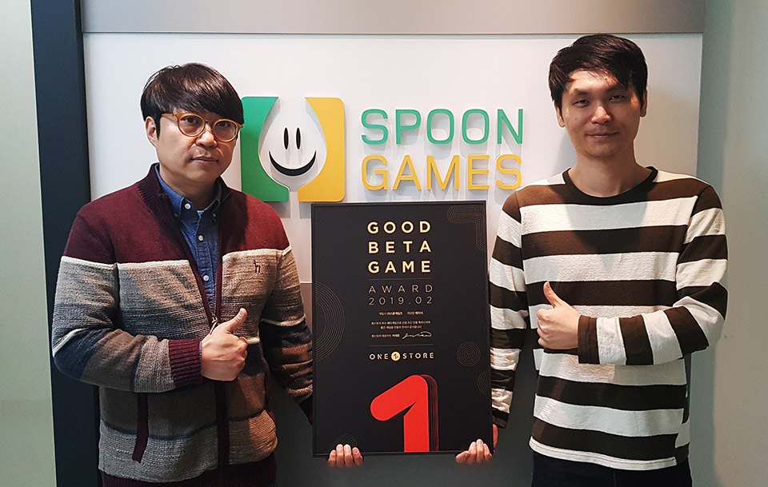

- **\- 오는 25일까지 14일간 3월 베타게임존 진행, 3월 인디게임존 전시작 공개**
- **\- 우수베타게임은 네이버, SK C&C 클라우드 인프라 비용 무상 지원**

㈜원스토어(대표: 이재환)는 ㈜스푼게임즈(대표: 하상백)의 '체이서'를 2월의 우수베타게임으로 선정했다고 밝혔다.

'체이서'는 3D 액션을 기반으로 한 고퀄리티 방치형 RPG로 눈이 즐거운 비주얼과 손이 편한 플레이가 가능한 게임이다. 독특한 스토리와 개성 있는 캐릭터를 통해 끊임없이 성장하는 재미를 느낄 수 있는 것이 특징으로 이번 베타게임존을 통해 큰 호평을 받았다.

㈜스푼게임즈 하상백 대표는 "예상보다 많은 이용자들이 참여해주셔서 감사 드리며, 베타게임존 기간 중 공식 오픈 채팅을 통해 이용자들의 수준 높은 피드백을 실시간으로 받는 계기가 됐다"며 "이용자들의 소중한 의견을 반영해 더 나은 모습으로 출시할 것을 약속드린다"고 전했다.

㈜스푼게임즈는 PC 온라인부터 모바일까지 풍부한 노하우를 토대로 게임 시장의 맛집이 되자는 신념을 지니고 있으며, 누구나 즐거워하는 '게임의 재미'를 추구하는 개발사이다.

선정된 우수베타게임은 네이버 클라우드 혹은 SK C&C의 클라우드 제트를 사용할 경우 게임 출시 전, 출시 당월과 익월까지 발생한 클라우드 인프라 비용을 무상으로 지원 받을 수 있다. 보다 자세한 내용은 원스토어 개발자센터에서 확인 가능하다.
