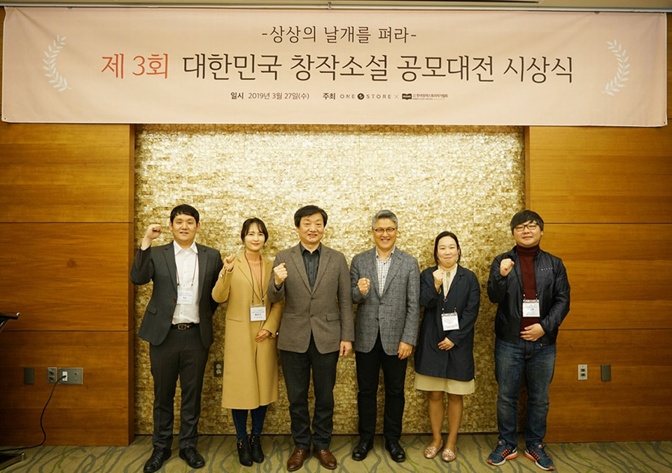

- **\- 전년 대비 심사작품 20% 증가 및 출품작 완성도 매년 상승**
- **\- 댓글 4만 2천여건 등 원스토어 북스 플랫폼 내 독자 활동도 증가**

원스토어 주식회사(대표 이재환)가 올해로 3회째를 맞이하는 '제 3회 대한민국 창작소설 공모대전' 시상식을 어제(27일) 오후 판교 코트야드 바이 메리어트 호텔에서 개최했다.

\[사진설명\] (사)한국창작스토리작가협회 성인규 회장(왼쪽에서 세번째), 원스토어 주식회사 이재환 대표(왼쪽에서 네번째)가 '제 3회 대한민국 창작소설 공모대전' 수상자들과 기념촬영을 하고 있다.

올해 처음으로 (사)한국창작스토리작가협회(회장 성인규)와 공동 개최한 이번 공모전은 '세상의 모든 스토리를 탐하다'라는 주제로 지난해 11월 1일부터 12월 31일까지 원스토어 북스 작가 연재 플랫폼 '원스토어 북스 스튜디오'와 웹소설 플랫폼 '스토리야'에서 진행되었다.

원스토어 공모전은 장르나 경력의 제한없이 누구나 참여 가능한 공모전으로 올해에는 총 800여편의 웹소설이 연재되는 성과를 거두었다. 특히, 출품 작품 중 전년 대비 20% 증가한 400편의 작품이 심사 대상으로 선정되었으며, 특정 장르에 편중되지 않고 로맨스, 판타지 등 다양한 장르의 참신한 작품이 대거 출품되었다.

공모전 출품작의 완성도가 높아지며 전년 대비 독자 반응도 활성화되었다. 공모전 기간 동안 연재 작품에 지난 2회 공모전보다 약 4배 가까이 증가한 4만 2천여건의 댓글이 달리며 작가와 독자의 활발한 소통이 이어졌다.

심사는 업계 전문가와 '원스토어 북스', '스토리야' 소속 심사위원들이 대중성, 독창성 등 8개 항목으로 평가했다. 대상은 <오! 나의 하녀님>(필명 봄온다)이 선정되었으며, 최우수상은 <너를 찾았어>(필명 flat), <컨티뉴 라이프>(필명 와와랑)가 차지했다.

<오! 나의 하녀님>은 매력적인 캐릭터와 에피소드들이 섬세하게 구성되어 독자와 공감대를 형성했다는 호평을 받았다. 특히, 개연성 있는 흥미로운 전개와 끝까지 긴장의 끈을 놓을 수 없는 강한 흡입력을 높게 평가받았다.

선정된 총 45편의 수상작 작가에게는 대상 상금 1,000만원을 포함해 총 5,600만원의 상금이 지급된다. 또한, 원스토어 북스 스튜디오 플랫폼 내 유료 판매는 물론 웹툰화 등 2차 퍼블리싱이 진행됨에 따라 추가적인 판매수익이 더해질 예정이다.

원스토어는 지난 1회 공모전 수상작품 중 <미래에서 온 그이>, <너를 향한 집착>, <나의 소원을 들어주오>, <그림자 탐정> 총 4개 작품을 웹툰화해 원스토어 북스에서 독점 연재하고 있으며, 현재 20여개의 작품이 웹툰 개발 검토 중이다. 이번 공모전 수상작 역시 콘텐츠 제작 파트너사들과 함께 웹툰이나 영상 콘텐츠로의 확장을 적극적으로 추진할 예정이다.

원스토어 이재환 대표는 "이번 공모전은 (사)한국창작스토리작가협회와 공동 개최해 플랫폼의 외연을 확대하고, 협력 관계를 구축하는 등 소기의 목적을 달성했다"며, "앞으로 외부 퍼블리싱 및 작가 계약 등 다양한 방향에서 협력을 확대해 좋은 콘텐츠를 가진 작가들의 활발한 참여를 이끌어내고, 좋은 이야기의 힘으로 독자에게 감동을 주는 선순환 서비스를 제공하기 위해 노력할 것"이라고 전했다.

이번 공모전 수상작은 원스토어 북스 앱의 웹소설 카테고리에서 확인할 수 있다.

한편, 원스토어가 2017년 6월 오픈한 '원스토어 북스 스튜디오'는 최근 영화 및 드라마 등의 원작으로 각광받는 웹소설, 웹툰 전용 플랫폼으로 지속적인 공모전 및 내부 작가 발굴 프로그램을 통해 역량 있는 신인 작가를 발굴하고 있으며 현재 140여명의 유료 작가가 활동 중이다.
