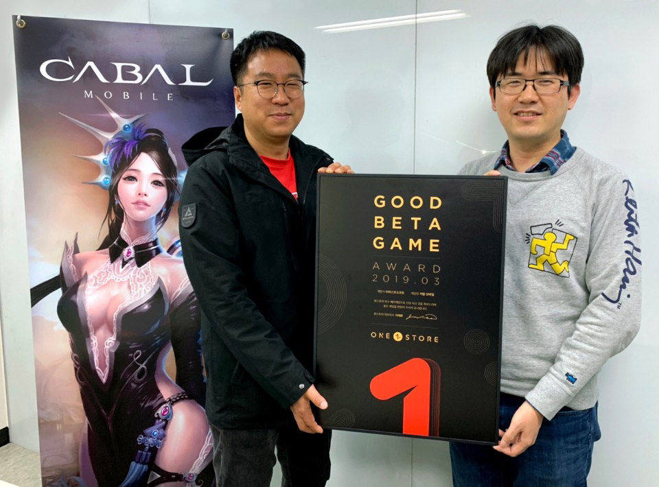
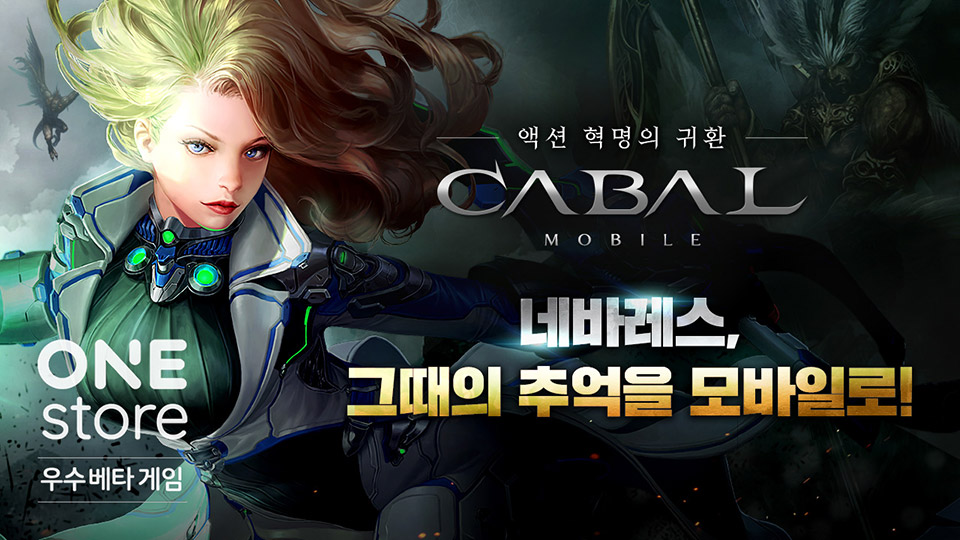

- **\- 오는 25일까지 14일간 4월 베타게임존 진행**
- **\- 인디게임존 4월 전시작 3종 공개**

(주)원스토어(대표: 이재환)는 (주)이스트게임즈의 '카발 모바일'을 3월의 우수베타게임으로 선정했다고 밝혔다.

'카발 모바일'은 '카발 온라인'의 IP를 정통으로 계승한 모바일 MMORPG로 자체 개발한 엔진 기반의 탄탄한 시나리오, 퀘스트 라인이 돋보인다. 특히, 다양한 전투스타일과 핵 앤 슬래시 방식의 '콤보 액션' 등 '카발 온라인'만의 시스템과 게임성을 그대로 구현해냈다는 평과 함께 원스토어 3월 베타게임존을 통해 가장 큰 관심을 받았다.

(주)이스트게임즈 이형백 대표는 "초기 PC 게임 시절 느꼈던 MMORPG의 재미와 카발 고유의 독특한 개성을 온전히 모바일에서 만날 수 있게 한 것에 높은 점수를 주신 것 같다"며 "베타테스트를 바탕으로 서비스 안정성을 다지고 완성도 높은 게임의 재미로 보답할 수 있도록 최선을 다하겠다"고 전했다.

(주)이스트게임즈는 2005년 PC MMORPG '카발 온라인'을 개발, 출시해 일본, 중국, 동남아시아, 유럽, 브라질 등 60여 개국에 수출했으며, 이를 바탕으로 2012년 액션 MMORPG '카발2'를 출시했다. 이후 2015년부터 '고양이 다방', '노바워즈: 커맨더스 리그' 등 다양한 장르의 모바일 게임 개발 및 서비스를 제공하고 있는 베테랑 개발사이다.

우수베타게임으로 선정된 '카발 모바일'은 네이버 클라우드 혹은 SK C&C의 클라우드 제트를 사용할 경우 게임 출시 전, 출시 당월과 익월까지 발생한 클라우드 인프라 비용을 원스토어로부터 무상으로 지원 받을 수 있다. 보다 자세한 내용은 원스토어 개발자센터에서 확인 가능하다.

원스토어는 12일(금)부터 25일(목)까지 4월 베타게임존을 진행한다. 베타게임존 게임을 다운받아 플레이하고, 설문을 작성한 유저 중 게임 당 최대 100명에게 원스토어 게임 캐쉬 1만원을 제공한다.

또한, 4월 인디게임존 전시작인 '갓 오브 히어로즈(나디아소프트)', '위험한 그놈들(루시드림)', '초성게임타임(IOI 게임즈)'를 전시 중으로 전시 기간 동안 해당 게임을 다운로드 할 경우 2,000원 상당 보상이 제공된다.
