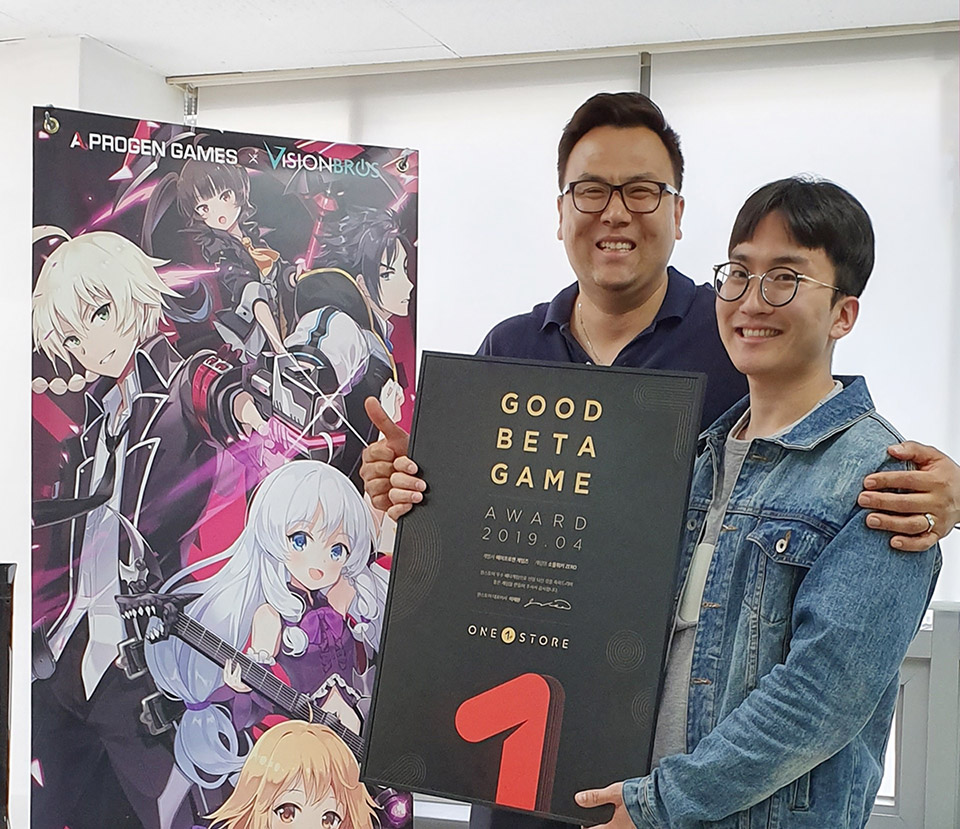
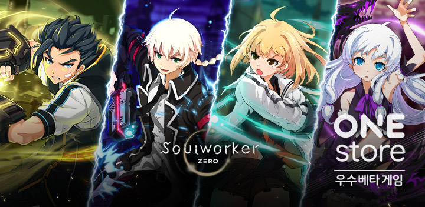

- **\- 13일부터 25일까지 13일간 5월 베타게임존 진행**
- **\- 인디게임존 5월 전시작 3종 공개**

(주)원스토어(대표: 이재환)는 에이프로젠 게임즈의 '소울워커 제로(ZERO)'를 4월의 우수베타게임으로 선정했다고 밝혔다.

'소울워커 제로'는 원작인 PC온라인 게임 '소울워커'가 갖고 있는 화려한 액션과 타격감을 모바일 플랫폼에 최적화한 것이 특징이다. 원스토어 4월 베타게임존에서도 원작만의 특장점을 이질감 없이 모바일 환경에 그대로 구현해냈다는 호평을 받으며 4월 우수베타게임으로 선정되었다.

에이프로젠 게임즈 김성수 본부장은 "정식 출시 전 원스토어 베타게임존으로 유저와 소통할 수 있는 기회를 얻은 것은 물론, '소울워커 제로'의 화려한 액션감에 대한 좋은 평가도 받을 수 있었다"며 "이달의 우수베타게임으로 선정된 것에 감사드리고, 앞으로도 원스토어와 좋은 협업으로 유저들이 보내준 기대에 부응할 수 있도록 서비스를 진행하겠다"고 전했다.

에이프로젠 게임즈는 에이프로젠 그룹의 자회사이며, '드래곤라자M'과 '포트리스M'을 성공적으로 출시한 바 있는 모바일 게임 퍼블리셔이다.

원스토어는 우수베타게임으로 선정된 '소울워커 제로'가 네이버 클라우드 혹은 SK C&C의 클라우드 제트를 사용할 경우 출시 전 클라우드 테스트 인프라 비용과 출시 당월과 익월까지 발생한 클라우드 인프라 비용을 무상으로 지원할 예정이다. 원스토어 우수베타게임 클라우드 비용 지원에 대한 보다 자세한 내용은 원스토어 개발자센터에서 확인 가능하다.

원스토어는 13일(월)부터 25일(토)까지 5월 베타게임존을 진행한다. 베타게임존 게임을 다운받아 플레이하고, 설문을 작성한 유저 중 게임 당 최대 100명에게 원스토어 게임 캐쉬 1만원을 제공한다.

또한, 5월 인디게임존 전시작으로 '2048윌유메리미(인디조이)', '걸스워즈(골든피그엔터테인먼트)', '마이플래닛(블루파이)'를 전시하며 전시 기간 동안 해당 게임을 다운로드 할 경우 2,000원 상당 보상을 제공한다.
