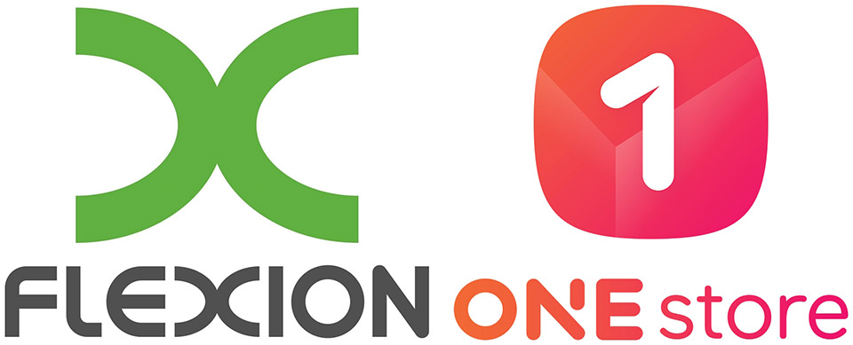

- **\- 글로벌 인기 게임 '총기시대' 원스토어 통해 출시**
- **\- 해외 유명 게임의 한국 시장 진출 협력해 시장 활성화 앞장설 예정**

글로벌 게임 유통업체 '플렉시온 모바일(Flexion Mobile Plc., 이하 플렉시온 모바일)'이 한국 게임 시장 활성화를 위해 원스토어 주식회사(대표 이재환)와 마케팅 협업을 추진한다.

플렉시온 모바일과 원스토어는 이번 마케팅 협업을 통해 해외 게임 개발 업체들의 원활한 한국 게임 시장 진출을 돕게 된다. 첫 협력 사업으로 최근 급성장 중인 '펀플러스(FunPlus, 이하 펀플러스)'의 모바일 게임 '총기시대(Guns of Glory, 이하 총기시대)'를 원스토어에서 5월 30일 출시하고, 마케팅 협업을 진행한다.

총기시대는 최근 급성장 중인 대형 전략게임이다. 글로벌 안드로이드 앱마켓에서 월 1천 5백만불(한화 약 180억원)의 매출을 기록하는 등 세계적인 인기를 모으고 있으며, 지난 5월 중순 플렉시온 모바일을 통해 원스토어에 사전등록 되었다.

플렉시온 모바일은 한국 대표 앱마켓이자 지난해 혁신적인 수수료 정책으로 매출 성장을 기록한 원스토어의 뛰어난 시장 경쟁력에 주목해 이번 협업을 결정했다. 특히, 원스토어만의 정교한 마케팅 지원과 비용 혜택이 강력한 IP(지적재산권)를 가진 해외 유명 게임들의 한국 시장 안착에 매력적인 요소로 작용할 것이라고 판단했다.

원스토어 이재환 대표는 "플렉시온 모바일과의 협력으로 원스토어에 해외 유명 게임 출시가 늘어남에 따라 국내 게임 시장 성장은 물론, 이용자에게는 더욱 많은 게임을 제공할 수 있어 만족도도 늘어날 것이라 기대된다"며, "이번 양사 협력은 안드로이드 게임 시장의 선순환 체계를 구축하는데 중요한 역할을 할 것"이라고 전했다.

플렉시온 모바일 CEO인 '옌스 로릿슨(Jens Lauritzson)'은 "한국 게임 유통 시장을 선도하는 원스토어와 긴밀하게 협업할 수 있어 기쁘다"며 "원스토어는 구글플레이의 대안이 될 수 있는 성공적 사례 중 하나라고 생각하며, 더 많은 해외 유명 게임들을 지속적으로 원스토어를 통해 출시할 예정"이라고 전했다.

한편, 플렉시온 모바일은 런던에 거점을 둔 안드로이드 게임 유통업체로 지난 2018년 6월 나스닥에 상장되었다.
